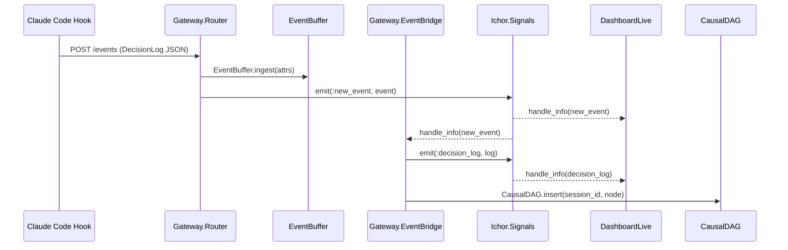
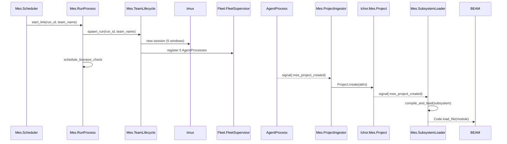
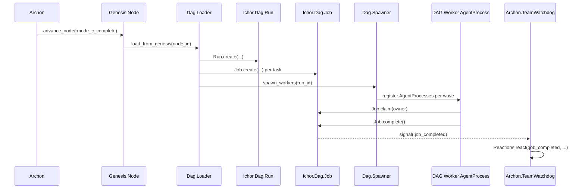

# Ichor (Host App) Refactor Analysis

## Overview

The host app is the composition root. It owns: the Phoenix web layer, the gateway ingestion
pipeline, agent fleet GenServers, the DAG runtime, Genesis pipeline, MES runtime, monitoring
observers, and Archon (the AI floor manager). It contains ~32,900 lines across ~190 modules.

---

## Module Inventory

### Core Infrastructure

| Module | File | Lines | Type | Purpose |
|--------|------|-------|------|---------|
| `Ichor.Application` | application.ex | 101 | Other | OTP start, supervision tree root |
| `Ichor.CoreSupervisor` | core_supervisor.ex | 25 | Other | Supervisor for Notes, EventJanitor, MemoryStore, EventBuffer |
| `Ichor.GatewaySupervisor` | gateway_supervisor.ex | 30 | Other | Supervisor for gateway GenServers |
| `Ichor.ObservationSupervisor` | observation_supervisor.ex | ~30 | Other | Supervisor for gateway observation services |
| `Ichor.MonitorSupervisor` | monitor_supervisor.ex | 30 | Other | Supervisor for monitoring observers |
| `Ichor.EventBuffer` | event_buffer.ex | 270 | GenServer | ETS event buffer, payload sanitization, tool duration tracking |
| `Ichor.EventJanitor` | event_janitor.ex | ~60 | GenServer | Periodic ETS eviction for tombstones/stale data |
| `Ichor.MemoryStore` | memory_store.ex | 500 | GenServer | Agent memory system (blocks, recall, archival); delegates to ichor_memory_core |
| `Ichor.MemoriesBridge` | memories_bridge.ex | 281 | GenServer | Bridges signals to external Memories API; batches by category |
| `Ichor.Notes` | notes.ex | ~60 | GenServer | Operator note store (ETS-backed) |
| `Ichor.Heartbeat` | heartbeat.ex | ~40 | GenServer | Emits periodic `:heartbeat` signal |
| `Ichor.Channels` | channels.ex | ~30 | Other | Channel configuration constants |
| `Ichor.MapHelpers` | map_helpers.ex | ~30 | Pure Function | Map utility helpers |
| `Ichor.Mailer` | mailer.ex | ~10 | Other | Swoosh mailer stub |

### Gateway

| Module | File | Lines | Type | Purpose |
|--------|------|-------|------|---------|
| `Ichor.Gateway.Router` | gateway/router.ex | 64 | Pure Function | Message bus: broadcast/ingest pipeline |
| `Ichor.Gateway.Router.Audit` | gateway/router/audit.ex | ~60 | Pure Function | Records delivery audit via signal |
| `Ichor.Gateway.Router.Delivery` | gateway/router/delivery.ex | ~80 | Pure Function | Delivers envelope to channel adapters |
| `Ichor.Gateway.Router.EventIngest` | gateway/router/event_ingest.ex | 155 | Pure Function | Inbound event processing: buffer, broadcast, signal |
| `Ichor.Gateway.Router.RecipientResolver` | gateway/router/recipient_resolver.ex | ~70 | Pure Function | Resolves channel pattern to agent list |
| `Ichor.Gateway.EventBridge` | gateway/event_bridge.ex | 293 | GenServer | Transforms events:stream -> DecisionLog, feeds CausalDAG + EntropyTracker |
| `Ichor.Gateway.EntropyTracker` | gateway/entropy_tracker.ex | 224 | GenServer | Sliding-window entropy/loop detection per session |
| `Ichor.Gateway.SchemaInterceptor` | gateway/schema_interceptor.ex | 222 | Pure Function | Validates DecisionLog changesets; enriches with entropy |
| `Ichor.Gateway.HeartbeatManager` | gateway/heartbeat_manager.ex | ~120 | GenServer | Tracks agent heartbeats; detects zombies |
| `Ichor.Gateway.HITLRelay` | gateway/hitl_relay.ex | 219 | GenServer | Human-in-the-loop pause/resume for agents |
| `Ichor.Gateway.CronScheduler` | gateway/cron_scheduler.ex | ~100 | GenServer | Cron job management |
| `Ichor.Infrastructure.CronJob` | gateway/cron_job.ex | ~40 | Other | Cron job struct |
| `Ichor.Gateway.CapabilityMap` | gateway/capability_map.ex | ~100 | GenServer | Tracks agent capabilities from heartbeats |
| `Ichor.Gateway.WebhookRouter` | gateway/webhook_router.ex | 162 | GenServer | Routes webhooks; dead-letter queue |
| `Ichor.Infrastructure.WebhookDelivery` | gateway/webhook_delivery.ex | ~80 | Pure Function | HTTP delivery for webhooks |
| `Ichor.Gateway.OutputCapture` | gateway/output_capture.ex | ~60 | GenServer | Captures terminal output |
| `Ichor.Gateway.TmuxDiscovery` | gateway/tmux_discovery.ex | 166 | GenServer | Discovers active tmux sessions |
| `Ichor.Gateway.TopologyBuilder` | gateway/topology_builder.ex | ~100 | GenServer | Builds topology snapshot for dashboard |
| `Ichor.Gateway.Envelope` | gateway/envelope.ex | ~40 | Other | Envelope struct |
| `Ichor.Gateway.Target` | gateway/target.ex | ~30 | Other | Delivery target struct |
| `Ichor.Infrastructure.Channels.Tmux` | gateway/channels/tmux.ex | 171 | Pure Function | Tmux delivery channel adapter |
| `Ichor.Infrastructure.Channels.MailboxAdapter` | gateway/channels/mailbox_adapter.ex | ~80 | Pure Function | Mailbox channel adapter |
| `Ichor.Infrastructure.Channels.SshTmux` | gateway/channels/ssh_tmux.ex | ~60 | Pure Function | SSH+tmux channel adapter |
| `Ichor.Infrastructure.Channels.WebhookAdapter` | gateway/channels/webhook_adapter.ex | ~50 | Pure Function | Webhook channel adapter |
| `Ichor.Gateway.HitlEvents` | gateway/hitl_events.ex | ~30 | Other | HITL event structs (contains nested modules) |
| `Ichor.Gateway.HitlInterventionEvent` | gateway/hitl_intervention_event.ex | ~20 | Other | HITL intervention struct |
| `Ichor.Gateway.HeartbeatRecord` | gateway/heartbeat_record.ex | ~30 | Other | Heartbeat record struct |
| `Ichor.Workshop.AgentEntry` | gateway/agent_registry/agent_entry.ex | ~80 | Pure Function | Agent entry helpers (UUID detection, short_id) |

### Fleet

| Module | File | Lines | Type | Purpose |
|--------|------|-------|------|---------|
| `Ichor.Fleet.FleetSupervisor` | fleet/fleet_supervisor.ex | ~100 | Other | Top-level fleet supervisor |
| `Ichor.Fleet.TeamSupervisor` | fleet/team_supervisor.ex | ~100 | GenServer | DynamicSupervisor per team |
| `Ichor.Fleet.AgentProcess` | fleet/agent_process.ex | 284 | GenServer | BEAM agent lifecycle, mailbox, liveness polling |
| `Ichor.Fleet.AgentProcess.Delivery` | fleet/agent_process/delivery.ex | ~80 | Pure Function | Backend delivery (tmux, webhook) |
| `Ichor.Fleet.AgentProcess.Lifecycle` | fleet/agent_process/lifecycle.ex | ~80 | Pure Function | Liveness check, terminate logic |
| `Ichor.Fleet.AgentProcess.Mailbox` | fleet/agent_process/mailbox.ex | ~60 | Pure Function | Message buffering and delivery |
| `Ichor.Fleet.AgentProcess.Registry` | fleet/agent_process/registry.ex | ~80 | Pure Function | Registry metadata operations |
| `Ichor.Fleet.HostRegistry` | fleet/host_registry.ex | 176 | GenServer | ETS registry for cluster nodes |
| `Ichor.Fleet.Runtime` | fleet/runtime.ex | ~43 | Pure Function | Delegation facade over fleet GenServers |
| `Ichor.Fleet.RuntimeView` | fleet/runtime_view.ex | ~60 | Pure Function | View projection from fleet GenServer state |
| `Ichor.Fleet.RuntimeQuery` | fleet/runtime_query.ex | ~60 | Pure Function | Query helpers over fleet data |
| `Ichor.Fleet.RuntimeHooks` | fleet/runtime_hooks.ex | ~60 | Other | After-action signal hooks for fleet events |
| `Ichor.Fleet.Lifecycle` | fleet/lifecycle.ex | 32 | Pure Function | Public lifecycle facade (delegates to submodules) |
| `Ichor.Fleet.Lifecycle.AgentLaunch` | fleet/lifecycle/agent_launch.ex | 145 | Pure Function | Agent spawn orchestration |
| `Ichor.Fleet.Lifecycle.TeamLaunch` | fleet/lifecycle/team_launch.ex | ~100 | Pure Function | Team spawn orchestration (tmux + BEAM) |
| `Ichor.Fleet.Lifecycle.Registration` | fleet/lifecycle/registration.ex | ~60 | Pure Function | Team/agent BEAM registration |
| `Ichor.Fleet.Lifecycle.Cleanup` | fleet/lifecycle/cleanup.ex | ~80 | Pure Function | Session/team teardown |
| `Ichor.Fleet.Analysis.Queries` | fleet/analysis/queries.ex | 172 | Pure Function | Fleet state analytics queries |
| `Ichor.Fleet.Analysis.SessionEviction` | fleet/analysis/session_eviction.ex | ~60 | Pure Function | Evicts stale sessions from event buffer |
| `Ichor.Fleet.Analysis.AgentHealth` | fleet/analysis/agent_health.ex | ~60 | Pure Function | Agent health score computation |
| `Ichor.Fleet.Overseer` | fleet/overseer.ex | ~80 | GenServer | Synthesized swarm state view |
| `Ichor.Fleet.Comms` | fleet/comms.ex | ~60 | Pure Function | Fleet messaging helpers |
| `Ichor.Fleet.Queries` | fleet/queries.ex | ~60 | Pure Function | Query helpers |
| `Ichor.Fleet.Lookup` | fleet/lookup.ex | ~40 | Pure Function | Agent lookup helpers |
| `Ichor.Fleet.SessionEviction` | fleet/session_eviction.ex | ~60 | Pure Function | Session eviction (duplicate of Analysis.SessionEviction?) |
| `Ichor.Fleet.Preparations.LoadAgents` | fleet/preparations/load_agents.ex | ~40 | Preparation | Loads agent data from EventBuffer for Ash reads |
| `Ichor.Fleet.Preparations.LoadTeams` | fleet/preparations/load_teams.ex | ~40 | Preparation | Loads team data from Registry for Ash reads |

### Monitoring

| Module | File | Lines | Type | Purpose |
|--------|------|-------|------|---------|
| `Ichor.SwarmMonitor` | swarm_monitor.ex | 214 | GenServer | Polls tasks.jsonl, runs health checks, projects pipeline state |
| `Ichor.SwarmMonitor.Analysis` | swarm_monitor/analysis.ex | ~80 | Pure Function | Task parsing and DAG analytics |
| `Ichor.SwarmMonitor.Actions` | swarm_monitor/actions.ex | ~80 | Pure Function | Task mutation actions (heal, reassign, claim) |
| `Ichor.SwarmMonitor.Discovery` | swarm_monitor/discovery.ex | ~60 | Pure Function | Project/team discovery from filesystem |
| `Ichor.SwarmMonitor.Health` | swarm_monitor/health.ex | ~60 | Pure Function | Health check script runner |
| `Ichor.SwarmMonitor.Projects` | swarm_monitor/projects.ex | ~80 | Pure Function | Project state management |
| `Ichor.SwarmMonitor.StateBus` | swarm_monitor/state_bus.ex | ~30 | Pure Function | Broadcasts swarm state via signal |
| `Ichor.SwarmMonitor.TaskState` | swarm_monitor/task_state.ex | ~40 | Other | Task state struct |
| `Ichor.ProtocolTracker` | protocol_tracker.ex | 276 | GenServer | Correlates multi-protocol message traces in ETS |
| `Ichor.AgentMonitor` | agent_monitor.ex | 211 | GenServer | Crash detection by polling events:stream |
| `Ichor.NudgeEscalator` | nudge_escalator.ex | 210 | GenServer | Progressive nudge/pause/zombie for stale agents |
| `Ichor.PaneMonitor` | pane_monitor.ex | 176 | GenServer | Tracks tmux pane changes |
| `Ichor.QualityGate` | quality_gate.ex | ~80 | GenServer | Evaluates agent quality gate results |

### MES (Manufacturing Execution System)

| Module | File | Lines | Type | Purpose |
|--------|------|-------|------|---------|
| `Ichor.Mes.Supervisor` | mes/supervisor.ex | ~40 | Other | MES supervision tree |
| `Ichor.Mes.RunProcess` | mes/run_process.ex | 175 | GenServer | One MES run lifecycle: spawn team, check liveness, react to signals |
| `Ichor.Mes.TeamSpawner` | mes/team_spawner.ex | 23 | Pure Function | Compat facade delegating to TeamLifecycle |
| `Ichor.Mes.TeamLifecycle` | mes/team_lifecycle.ex | 61 | Pure Function | MES-specific launch/cleanup coordination |
| `Ichor.Mes.TeamSpecBuilder` | mes/team_spec_builder.ex | ~80 | Pure Function | Builds team specs for MES runs |
| `Ichor.Mes.TeamPrompts` | mes/team_prompts.ex | 486 | Pure Function | Prompt strings for MES agent roles (OVER LIMIT) |
| `Ichor.Mes.TeamCleanup` | mes/team_cleanup.ex | ~80 | Pure Function | MES-specific tmux/team cleanup |
| `Ichor.Mes.Scheduler` | mes/scheduler.ex | 144 | GenServer | Controls run concurrency; schedules new runs |
| `Ichor.Mes.Janitor` | mes/janitor.ex | ~80 | GenServer | Monitors run health; emits cleanup signals |
| `Ichor.Mes.CompletionHandler` | mes/completion_handler.ex | ~80 | GenServer | Reacts to dag_run_completed -> SubsystemLoader |
| `Ichor.Mes.ProjectIngestor` | mes/project_ingestor.ex | 228 | GenServer | Parses MES agent output -> Project resource |
| `Ichor.Mes.ResearchIngestor` | mes/research_ingestor.ex | 154 | GenServer | Parses research agent output |
| `Ichor.Mes.ResearchContext` | mes/research_context.ex | 154 | Pure Function | Research context builder |
| `Ichor.Mes.ResearchStore` | mes/research_store.ex | ~60 | GenServer | Research data persistence (ETS) |
| `Ichor.Mes.SubsystemLoader` | mes/subsystem_loader.ex | ~100 | Pure Function | Hot-loads subsystem Mix projects into BEAM |
| `Ichor.Mes.SubsystemScaffold` | mes/subsystem_scaffold.ex | ~100 | Pure Function | Scaffolds subsystem dir structure |
| `Ichor.Mes.SubsystemScaffold.Templates` | mes/subsystem_scaffold/templates.ex | 163 | Pure Function | Template string builders for scaffold |

### Genesis Pipeline

| Module | File | Lines | Type | Purpose |
|--------|------|-------|------|---------|
| `Ichor.Genesis.Supervisor` | genesis/supervisor.ex | ~25 | Other | Genesis supervision tree |
| `Ichor.Genesis.ModeRunner` | genesis/mode_runner.ex | 113 | Pure Function | Tmux session/window creation for genesis modes |
| `Ichor.Genesis.ModeSpawner` | genesis/mode_spawner.ex | 190 | Pure Function | Orchestrates mode agent list + ModeRunner calls |
| `Ichor.Genesis.ModePrompts` | genesis/mode_prompts.ex | 312 | Pure Function | Prompt strings for A/B/C mode agents (OVER LIMIT) |
| `Ichor.Genesis.RunProcess` | genesis/run_process.ex | ~140 | GenServer | One genesis run: mode A->B->C state machine |
| `Ichor.Genesis.PipelineStage` | genesis/pipeline_stage.ex | 155 | Pure Function | Stage transition helpers |
| `Ichor.Genesis.DagGenerator` | genesis/dag_generator.ex | ~100 | Pure Function | Converts genesis plan -> DAG job graph |

### DAG Runtime (in ichor app)

| Module | File | Lines | Type | Purpose |
|--------|------|-------|------|---------|
| `Ichor.Dag.Supervisor` | dag/supervisor.ex | ~25 | Other | DAG DynamicSupervisor |
| `Ichor.Dag.RunSupervisor` | dag/run_supervisor.ex | ~40 | Other | Wrapper for DynRunSupervisor |
| `Ichor.Dag.RunProcess` | dag/run_process.ex | 166 | GenServer | One DAG run lifecycle: dispatch workers, monitor |
| `Ichor.Dag.Spawner` | dag/spawner.ex | 155 | Pure Function | Builds and registers DAG agents |
| `Ichor.Dag.WorkerGroups` | dag/worker_groups.ex | ~100 | Pure Function | Groups workers by wave |
| `Ichor.Dag.Loader` | dag/loader.ex | ~80 | Pure Function | Loads DAG from genesis or tasks.jsonl |
| `Ichor.Dag.Graph` | dag/graph.ex | 217 | Pure Function | Pure DAG computation: waves, edges, critical path |
| `Ichor.Dag.Validator` | dag/validator.ex | 160 | Pure Function | Validates DAG structure |
| `Ichor.Dag.Exporter` | dag/exporter.ex | ~80 | Pure Function | Exports DAG to tasks.jsonl |
| `Ichor.Dag.HealthChecker` | dag/health_checker.ex | ~80 | Pure Function | Checks DAG run health |
| `Ichor.Dag.Prompts` | dag/prompts.ex | 262 | Pure Function | Prompt strings for DAG worker roles (OVER LIMIT) |
| `Ichor.Dag.RuntimeEventBridge` | dag/runtime_event_bridge.ex | ~80 | GenServer | Bridges events to DAG runtime signals |
| `Ichor.Dag.RuntimeSignals` | dag/runtime_signals.ex | ~60 | Pure Function | DAG-specific signal emission |

### Archon (AI Floor Manager)

| Module | File | Lines | Type | Purpose |
|--------|------|-------|------|---------|
| `Ichor.Archon` | archon.ex | ~50 | Other | Archon module entry point |
| `Ichor.Archon.SignalManager` | archon/signal_manager.ex | 63 | GenServer | Subscribes to all signals; projects compact attention view |
| `Ichor.Archon.SignalManager.Reactions` | archon/signal_manager/reactions.ex | 197 | Pure Function | Signal classification and state update logic |
| `Ichor.Archon.TeamWatchdog` | archon/team_watchdog.ex | 84 | GenServer | Signal-driven team lifecycle monitor; dispatches to Dag+Fleet |
| `Ichor.Archon.TeamWatchdog.Reactions` | archon/team_watchdog/reactions.ex | ~80 | Pure Function | Decision logic for watchdog actions |
| `Ichor.Archon.Chat` | archon/chat.ex | ~40 | Other | Chat entry point |
| `Ichor.Archon.Chat.ChainBuilder` | archon/chat/chain_builder.ex | ~60 | Pure Function | LangChain chain assembly |
| `Ichor.Archon.Chat.ContextBuilder` | archon/chat/context_builder.ex | ~80 | Pure Function | Builds context for LLM from system state |
| `Ichor.Archon.Chat.CommandParser` | archon/chat/command_parser.ex | ~60 | Pure Function | Parses slash commands from chat input |
| `Ichor.Archon.Chat.CommandRegistry` | archon/chat/command_registry.ex | 156 | Pure Function | Registry of available Archon commands |
| `Ichor.Archon.Chat.Commands` | archon/chat/commands.ex | ~80 | Pure Function | Command implementations |
| `Ichor.Archon.Chat.TurnRunner` | archon/chat/turn_runner.ex | ~80 | Pure Function | LLM turn execution |
| `Ichor.Archon.Chat.ActionRunner` | archon/chat/action_runner.ex | ~60 | Pure Function | Tool/action dispatch from LLM output |
| `Ichor.Archon.Chat.ResponseFormatter` | archon/chat/response_formatter.ex | ~40 | Pure Function | Formats LLM response for chat |
| `Ichor.Archon.CommandManifest` | archon/command_manifest.ex | ~60 | Pure Function | Tool manifest for MCP |
| `Ichor.Archon.MemoriesClient` | archon/memories_client.ex | 212 | Pure Function | HTTP client for external Memories API (contains nested modules) |
| `Ichor.Archon.Tools` | archon/tools.ex | ~30 | Other | Archon tool domain entry |
| `Ichor.Archon.Tools.Manager` | archon/tools/manager.ex | ~60 | Ash Resource | Archon tool domain |
| `Ichor.Archon.Tools.Agents` | archon/tools/agents.ex | ~80 | Ash Resource | Agent management tools for Archon |
| `Ichor.Archon.Tools.Control` | archon/tools/control.ex | 178 | Ash Resource | Control/HITL tools for Archon |
| `Ichor.Archon.Tools.Events` | archon/tools/events.ex | ~60 | Ash Resource | Event query tools for Archon |
| `Ichor.Archon.Tools.Memory` | archon/tools/memory.ex | ~80 | Ash Resource | Memory tools for Archon |
| `Ichor.Archon.Tools.Mes` | archon/tools/mes.ex | 259 | Ash Resource | MES management tools for Archon |
| `Ichor.Archon.Tools.Messages` | archon/tools/messages.ex | ~60 | Ash Resource | Messaging tools for Archon |
| `Ichor.Archon.Tools.System` | archon/tools/system.ex | ~60 | Ash Resource | System info tools for Archon |
| `Ichor.Archon.Tools.Teams` | archon/tools/teams.ex | ~80 | Ash Resource | Team management tools for Archon |

### MCP Agent Tools

| Module | File | Lines | Type | Purpose |
|--------|------|-------|------|---------|
| `Ichor.AgentTools` | agent_tools.ex | 97 | Ash Domain | MCP tool domain exposed to agents |
| `Ichor.AgentTools.Inbox` | agent_tools/inbox.ex | ~80 | Ash Resource | check_inbox, send_message, acknowledge |
| `Ichor.AgentTools.Tasks` | agent_tools/tasks.ex | ~80 | Ash Resource | get_tasks, update_task_status |
| `Ichor.AgentTools.Memory` | agent_tools/memory.ex | 145 | Ash Resource | Core memory read/write tools |
| `Ichor.AgentTools.Recall` | agent_tools/recall.ex | ~60 | Ash Resource | Recall search tools |
| `Ichor.AgentTools.Archival` | agent_tools/archival.ex | ~80 | Ash Resource | Archival memory tools |
| `Ichor.AgentTools.Agents` | agent_tools/agents.ex | ~60 | Ash Resource | Agent create/list tools |
| `Ichor.AgentTools.Spawn` | agent_tools/spawn.ex | ~60 | Ash Resource | spawn_agent, stop_agent tools |
| `Ichor.AgentTools.GenesisNodes` | agent_tools/genesis_nodes.ex | 168 | Ash Resource | Genesis node CRUD + advance |
| `Ichor.AgentTools.GenesisArtifacts` | agent_tools/genesis_artifacts.ex | 165 | Ash Resource | ADR/Feature/UseCase creation |
| `Ichor.AgentTools.GenesisGates` | agent_tools/genesis_gates.ex | ~80 | Ash Resource | Checkpoint + Conversation tools |
| `Ichor.AgentTools.GenesisRoadmap` | agent_tools/genesis_roadmap.ex | 185 | Ash Resource | Phase/Section/Task/Subtask creation |
| `Ichor.AgentTools.DagExecution` | agent_tools/dag_execution.ex | 203 | Ash Resource | Job claim/complete/fail, run load/export |

### Other Business Logic

| Module | File | Lines | Type | Purpose |
|--------|------|-------|------|---------|
| `Ichor.Activity.EventAnalysis` | activity/event_analysis.ex | 209 | Pure Function | Analyzes event streams for activity feed |
| `Ichor.AgentSpawner` | agent_spawner.ex | ~60 | Other | Agent ID counter |
| `Ichor.Operator` | operator.ex | ~80 | GenServer | Operator message log (filesystem + ETS) |
| `Ichor.TaskManager` | task_manager.ex | 204 | GenServer | Manages tasks.jsonl files for agent teams |
| `Ichor.InstructionOverlay` | instruction_overlay.ex | 257 | Pure Function | Generates CLAUDE.md overlays for agents |
| `Ichor.Costs` | costs.ex | ~40 | Other | Cost domain entry |
| `Ichor.Costs.CostAggregator` | costs/cost_aggregator.ex | ~80 | Pure Function | Aggregates token costs from events |
| `Ichor.Tools.AgentControl` | tools/agent_control.ex | ~60 | Pure Function | Agent control helpers |
| `Ichor.Tools.GenesisFormatter` | tools/genesis_formatter.ex | ~60 | Pure Function | Genesis output formatting |
| `Ichor.Tools.Messaging` | tools/messaging.ex | ~60 | Pure Function | Messaging helpers |
| `Ichor.Workshop.Launcher` | workshop/launcher.ex | ~60 | Pure Function | Launches workshop blueprints |
| `Ichor.Plugs.OperatorAuth` | plugs/operator_auth.ex | ~40 | Other | Phoenix plug for operator auth |
| `Ichor.QualityGate` | quality_gate.ex | ~80 | GenServer | Evaluates quality gate signals |

### Web Layer (IchorWeb)

| Module | File | Lines | Type | Purpose |
|--------|------|-------|------|---------|
| `IchorWeb.DashboardLive` | live/dashboard_live.ex | 312 | LiveView | Root LiveView; event routing dispatcher |
| `IchorWeb.DashboardState` | live/dashboard_state.ex | 419 | Pure Function | `recompute/1` and `recompute_view/1`; orchestrates all assigns |
| `IchorWeb.DashboardGatewayHandlers` | live/dashboard_gateway_handlers.ex | 329 | Pure Function | Gateway signal handlers; subscribe+seed |
| `IchorWeb.DashboardFeedHelpers` | live/dashboard_feed_helpers.ex | 521 | Pure Function | Feed group building logic (OVER LIMIT) |
| `IchorWeb.DashboardFormatHelpers` | live/dashboard_format_helpers.ex | 267 | Pure Function | Formatting helpers (time, size, truncation) |
| `IchorWeb.DashboardDataHelpers` | live/dashboard_data_helpers.ex | ~120 | Pure Function | filtered_events, filtered_sessions |
| `IchorWeb.DashboardAgentHelpers` | live/dashboard_agent_helpers.ex | ~80 | Pure Function | Agent task derivation |
| `IchorWeb.DashboardAgentActivityHelpers` | live/dashboard_agent_activity_helpers.ex | 225 | Pure Function | Agent event stream helpers |
| `IchorWeb.DashboardAgentHealthHelpers` | live/dashboard_agent_health_helpers.ex | ~80 | Pure Function | Agent health UI helpers |
| `IchorWeb.DashboardArchonHandlers` | live/dashboard_archon_handlers.ex | ~80 | Pure Function | Archon chat event handlers |
| `IchorWeb.DashboardFeedHandlers` | live/dashboard_feed_handlers.ex | ~60 | Pure Function | Feed collapse/expand handlers |
| `IchorWeb.DashboardFilterHandlers` | live/dashboard_filter_handlers.ex | 144 | Pure Function | Filter event handlers |
| `IchorWeb.DashboardFleetTreeHandlers` | live/dashboard_fleet_tree_handlers.ex | ~60 | Pure Function | Fleet tree toggle handlers |
| `IchorWeb.DashboardGatewayHandlers` | live/dashboard_gateway_handlers.ex | 329 | Pure Function | Gateway signal ingestion into assigns |
| `IchorWeb.DashboardInfoHandlers` | live/dashboard_info_handlers.ex | 205 | Pure Function | Info panel handler: genesis node detail |
| `IchorWeb.DashboardMesHandlers` | live/dashboard_mes_handlers.ex | 210 | Pure Function | MES control panel event handlers |
| `IchorWeb.DashboardMesResearchHandlers` | live/dashboard_mes_research_handlers.ex | ~80 | Pure Function | MES research tab handlers |
| `IchorWeb.DashboardMessageHelpers` | live/dashboard_message_helpers.ex | 153 | Pure Function | Message search/thread grouping |
| `IchorWeb.DashboardMessagingHandlers` | live/dashboard_messaging_handlers.ex | ~80 | Pure Function | Messaging tab handlers |
| `IchorWeb.DashboardNavigationHandlers` | live/dashboard_navigation_handlers.ex | ~80 | Pure Function | Navigation/view jump handlers |
| `IchorWeb.DashboardNotesHandlers` | live/dashboard_notes_handlers.ex | ~60 | Pure Function | Notes panel handlers |
| `IchorWeb.DashboardNotificationHandlers` | live/dashboard_notification_handlers.ex | ~60 | Pure Function | Toast/notification handlers |
| `IchorWeb.DashboardPhase5Handlers` | live/dashboard_phase5_handlers.ex | ~120 | Pure Function | Phase5/forensic/god-mode handlers |
| `IchorWeb.DashboardSelectionHandlers` | live/dashboard_selection_handlers.ex | ~80 | Pure Function | Selection state handlers |
| `IchorWeb.DashboardSessionControlHandlers` | live/dashboard_session_control_handlers.ex | 238 | Pure Function | Pause/resume/shutdown/HITL handlers |
| `IchorWeb.DashboardSessionHelpers` | live/dashboard_session_helpers.ex | ~80 | Pure Function | Session data helpers |
| `IchorWeb.DashboardSlideoutHandlers` | live/dashboard_slideout_handlers.ex | ~60 | Pure Function | Agent slideout handlers |
| `IchorWeb.DashboardSpawnHandlers` | live/dashboard_spawn_handlers.ex | ~80 | Pure Function | Agent spawn handlers |
| `IchorWeb.DashboardSwarmHandlers` | live/dashboard_swarm_handlers.ex | 149 | Pure Function | Swarm monitor event handlers |
| `IchorWeb.DashboardTaskHandlers` | live/dashboard_task_handlers.ex | 186 | Pure Function | Task CRUD handlers |
| `IchorWeb.DashboardTeamHelpers` | live/dashboard_team_helpers.ex | 176 | Pure Function | Team state computation |
| `IchorWeb.DashboardTeamInspectorHandlers` | live/dashboard_team_inspector_handlers.ex | ~80 | Pure Function | Team inspector panel handlers |
| `IchorWeb.DashboardTimelineHelpers` | live/dashboard_timeline_helpers.ex | ~80 | Pure Function | Timeline data helpers |
| `IchorWeb.DashboardTmuxHandlers` | live/dashboard_tmux_handlers.ex | 193 | Pure Function | Tmux interaction handlers |
| `IchorWeb.DashboardToast` | live/dashboard_toast.ex | ~40 | Pure Function | Toast notification helpers |
| `IchorWeb.DashboardUIHandlers` | live/dashboard_ui_handlers.ex | 146 | Pure Function | Generic UI toggle handlers |
| `IchorWeb.DashboardViewRouter` | live/dashboard_view_router.ex | ~60 | Pure Function | Routes view_mode changes |
| `IchorWeb.DashboardWorkshopHandlers` | live/dashboard_workshop_handlers.ex | 169 | Pure Function | Workshop panel handlers |
| `IchorWeb.SessionDrilldownLive` | live/session_drilldown_live.ex | ~80 | LiveView | Session detail view |
| `IchorWeb.WorkshopPersistence` | live/workshop_persistence.ex | ~60 | Pure Function | Workshop state persistence |
| `IchorWeb.WorkshopPresets` | live/workshop_presets.ex | ~60 | Pure Function | Workshop preset definitions |
| `IchorWeb.WorkshopTypes` | live/workshop_types.ex | ~60 | Pure Function | Workshop type definitions |

---

## Cross-References

### This app calls INTO sub-apps

| Caller (ichor/) | Called (sub-app) | Via |
|-----------------|------------------|-----|
| `Archon.TeamWatchdog` | `Ichor.Dag.{Job,Run}` | Direct code_interface |
| `Archon.TeamWatchdog` | `Ichor.Fleet.FleetSupervisor` | Direct call |
| `Archon.Tools.Mes` | `Ichor.Mes.Project` | code_interface |
| `AgentTools.*` | `Ichor.Genesis.*` | code_interface |
| `AgentTools.DagExecution` | `Ichor.Dag.{Job,Run}` | code_interface |
| `Dag.Spawner` | `Ichor.Genesis.Node` | code_interface |
| `Dag.Loader` | `Ichor.Genesis.{DagGenerator,Node}` | Direct call |
| `Dag.RunProcess` | `Ichor.Genesis.ModeRunner` | Direct call |
| `DashboardState` | `Ichor.Activity.{Error,Message,Task}` | code_interface |
| `DashboardState` | `Ichor.Fleet.{Agent,Team}` | code_interface |
| `DashboardMesHandlers` | `Ichor.Genesis.{Node,ModeSpawner}` | Direct |
| `Mes.CompletionHandler` | `Ichor.Genesis.Node` | code_interface |
| `Gateway.EventBridge` | `Ichor.Mesh.{CausalDAG,DecisionLog}` | Direct |
| `Gateway.SchemaInterceptor` | `Ichor.Mesh.DecisionLog` | Direct |

### Sub-apps that call INTO this app

None. Sub-apps are libraries; they do not depend on the host app.

---

## Architecture Diagrams

### Supervision Tree

```mermaid
graph TD
    App[Ichor.Application]
    App --> PubSub[Phoenix.PubSub]
    App --> Registry[Ichor.Registry]
    App --> PG[:pg ichor_agents]
    App --> HostReg[Fleet.HostRegistry]
    App --> Core[CoreSupervisor]
    App --> Gateway[GatewaySupervisor]
    App --> Fleet[Fleet.FleetSupervisor]
    App --> Mesh[ObservationSupervisor]
    App --> TaskSup[Task.Supervisor]
    App --> MES[Mes.Supervisor]
    App --> Genesis[Genesis.Supervisor]
    App --> DAG[Dag.Supervisor]
    App --> MemBridge[MemoriesBridge]
    App --> Monitor[MonitorSupervisor]
    App --> Web[IchorWeb.Endpoint]

    Core --> Notes[Notes]
    Core --> Janitor[EventJanitor]
    Core --> MemStore[MemoryStore]
    Core --> EventBuf[EventBuffer]

    Gateway --> EntTrack[EntropyTracker]
    Gateway --> CapMap[CapabilityMap]
    Gateway --> HBMgr[HeartbeatManager]
    Gateway --> CronSched[CronScheduler]
    Gateway --> WebhookRouter
    Gateway --> HITL[HITLRelay]
    Gateway --> OutputCap[OutputCapture]
    Gateway --> TmuxDisc[TmuxDiscovery]

    Fleet --> TeamSup1[TeamSupervisor per team]
    Fleet --> StandaloneAgents[AgentProcess standalone]

    Monitor --> Heartbeat
    Monitor --> SwarmMon[SwarmMonitor]
    Monitor --> ProtoTrack[ProtocolTracker]
    Monitor --> AgentMon[AgentMonitor]
    Monitor --> Nudge[NudgeEscalator]
    Monitor --> QualGate[QualityGate]
    Monitor --> PaneMon[PaneMonitor]
    Monitor --> SignalBuf[Signals.Buffer]
    Monitor --> SignalMgr[Archon.SignalManager]
    Monitor --> Watchdog[Archon.TeamWatchdog]
```

### Main Signal Flow

### MES Manufacturing Pipeline

### DAG Execution Flow

---

## Boundary Violations

### HIGH: Nested modules (violates BRAIN.md rule)

1. `Ichor.Archon.MemoriesClient` (memories_client.ex:19,33,48,64) defines four nested modules:
   `IngestResult`, `ChunkedIngestResult`, `SearchResult`, `QueryResult`. Each should be its own
   file under `archon/memories_client/`.

2. `Ichor.Gateway.HitlEvents` (gateway/hitl_events.ex:6,11) defines `GateOpenEvent` and
   `GateCloseEvent` as nested modules.

3. `Ichor.Mesh.DecisionLog` (mesh/decision_log.ex:17,54,84,120,158,183) defines six nested
   modules: `Meta`, `Identity`, `Cognition`, `Action`, `StateDelta`, `Control`. This is the
   worst case -- lives in ichor_mesh, not ichor.

4. `Ichor.Mesh.CausalDAG` (mesh/causal_dag.ex:14) defines nested `Node` struct.

### HIGH: Direct Ash.create/update/destroy bypassing code_interface

1. `Ichor.Workshop.Persistence` (persistence.ex:26,32,50): Uses `Ash.Changeset.for_create`,
   `Ash.create`, `Ash.update`, `Ash.destroy` directly instead of code_interface functions.
   `TeamBlueprint` should expose `create/1`, `update/2`, `destroy/1` via `code_interface`.

2. `IchorWeb.DashboardWorkshopHandlers` (workshop_handlers.ex:127): `Ash.destroy!(bp)` directly.

3. `IchorWeb.WorkshopTypes` (workshop_types.ex:53): `Ash.destroy!(type)` directly.

4. `IchorWeb.Controllers.ExportController` (export_controller.ex:9): `Ash.read(Event, action: :read)`.
   Should use `Ichor.Events.Event.read!()` or equivalent code_interface.

5. `Ichor.Workshop.Persistence` (persistence.ex:12): `Ash.load!(blueprint, [...])` without domain.

### MEDIUM: LiveView calling resource modules directly (bypass Domain)

`IchorWeb.DashboardMesHandlers` aliases and calls `Ichor.Genesis.Node` directly (dashboard_mes_handlers.ex:9).
Genesis Node actions should be accessed via the `Ichor.Genesis` domain or a service boundary.
Similarly `DashboardInfoHandlers` calls `Ichor.Genesis.Node.by_project/2` directly (dashboard_info_handlers.ex:186).

### MEDIUM: Archon.Tools.Mes calling resource code_interface without Domain

`Ichor.Archon.Tools.Mes` aliases `Ichor.Mes.Project` directly (archon/tools/mes.ex:9) and calls
`Project.list_all!()`, `Project.by_status!()`, `Project.create()`. These should go through
`Ichor.Mes` domain. The same applies for `RunProcess.list_all()` called directly on the struct.

### MEDIUM: Dag.Spawner cross-domain call to Genesis

`Ichor.Dag.Spawner` (dag/spawner.ex:32) calls `Ichor.Genesis.Node.get(node_id)` directly. DAG
should receive a plain struct from its caller, not reach into Genesis domain to fetch records.

### MEDIUM: TeamWatchdog calling Job/Run code_interface directly

`Ichor.Archon.TeamWatchdog` (team_watchdog.ex:13) imports `Ichor.Dag.{Job,Run}` and calls
`Run.get/1`, `Run.archive/1`, `Job.by_run/1`, `Job.reset/1`. These should go through `Ichor.Dag`
domain or a DAG service facade.

### LOW: EventBridge calling Mesh modules from Gateway namespace

`Ichor.Gateway.EventBridge` calls `Ichor.Mesh.CausalDAG` and `Ichor.Mesh.DecisionLog` directly.
While both live under the ichor app, Gateway and Mesh are notionally separate bounded contexts.
Consider making this an explicit allowed cross-context dependency or abstracting via signal.

### LOW: AgentMonitor subscribes to raw PubSub "events:stream" topic

`Ichor.AgentMonitor` (agent_monitor.ex:22) and `Ichor.NudgeEscalator` (nudge_escalator.ex:44)
subscribe to `"events:stream"` PubSub directly rather than through `Ichor.Signals.subscribe(:events)`.
This bypasses the catalog-validated signal system. Use signal subscription throughout.

---

## Consolidation Plan

### Merge (too small, single caller)

1. **`Ichor.Mes.TeamSpawner` -> remove**: Pure facade, 23 lines, 100% delegates to
   `TeamLifecycle`. All callers can alias `TeamLifecycle` directly. Dead abstraction layer.

2. **`Ichor.Fleet.Lifecycle` -> remove**: 32-line pure delegate to submodules. All callers can
   use `AgentLaunch`, `Cleanup`, `TeamLaunch` directly. Same issue.

3. **`Ichor.Fleet.Runtime` -> slim significantly**: Large delegate chain (43 lines). Some
   duplicates `Fleet.Lifecycle`. Keep as the canonical public API boundary but prune duplicates.

4. **`Ichor.Fleet.SessionEviction` vs `Fleet.Analysis.SessionEviction`**: Likely duplicate.
   Should be one module under `Analysis`.

### Split (too large, multiple responsibilities)

1. **`IchorWeb.DashboardFeedHelpers` (521 lines)**: Exceeds 200-line limit. Split into:
   - `DashboardFeedHelpers` (core grouping logic)
   - `DashboardFeedEventHelpers` (event classification)
   - `DashboardFeedRenderHelpers` (display helpers)

2. **`Ichor.MemoryStore` (500 lines)**: Already delegates to ichor_memory_core but still has
   500-line GenServer body. The handler functions duplicate ichor_memory_core module purposes.
   Consider if GenServer is really needed or if ETS access can be direct (reads are already
   concurrent via public tables).

3. **`Ichor.Mes.TeamPrompts` (486 lines)**: Pure prompt strings. Split by mode:
   - `Mes.TeamPrompts.ModeA`
   - `Mes.TeamPrompts.ModeB`
   - `Mes.TeamPrompts.ModeC`
   - `Mes.TeamPrompts.Common`

4. **`IchorWeb.DashboardState` (419 lines)**: Two very different functions (`recompute` full and
   `recompute_view` display-only). Each should have its own helpers. Split into:
   - `DashboardState` (assign management, recompute orchestration)
   - `DashboardQueryHelpers` (the Ash domain calls)

5. **`Ichor.Archon.MemoriesClient` (212 lines)**: Nested modules `IngestResult`,
   `ChunkedIngestResult`, `SearchResult`, `QueryResult` must be extracted to own files.

6. **`Ichor.Mesh.DecisionLog` (277 lines)**: Six nested structs (`Meta`, `Identity`, `Cognition`,
   `Action`, `StateDelta`, `Control`) violate nested module rule and bloat the file.

7. **`Ichor.Gateway.SchemaInterceptor` (222 lines)**: Mixed responsibilities: validation,
   entropy enrichment, alert deduplication, violation event building. Split validate from enrich.

8. **`Ichor.Dag.Prompts` (262 lines)**: Pure prompt strings, same as TeamPrompts issue.
   Split by worker role.

9. **`Ichor.Genesis.ModePrompts` (312 lines)**: Split by mode A/B/C.

### Dead Code

1. **`Ichor.Fleet.AgentProcess.Registry.fields_from_event/1`**: Should be audited -- the
   `handle_info` that calls it reacts to `:agent_event` signals but the field mapping may
   be incomplete/stale.

2. **`subscribe_gateway_topics/0` in `DashboardGatewayHandlers`** (gateway_handlers.ex:21-25):
   Is a no-op. The import contract is kept but it does nothing. Either remove or document why.

3. **`Ichor.ProtocolTracker.compute_stats/0`**: The `command_queue.sessions` and
   `command_queue.total_pending` fields always return 0 (protocol_tracker.ex:258-260). Dead code.

4. **`Ichor.AgentMonitor`**: Crash detection by polling events:stream. The same crash signal
   is also emitted by `NudgeEscalator`. Possible overlap -- audit which signal takes authority.

---

## Priority

### HIGH (correctness + principle violations)

- [ ] Extract nested modules from `MemoriesClient`, `HitlEvents`, `DecisionLog`, `CausalDAG`
- [ ] Fix `Workshop.Persistence` to use code_interface not raw `Ash.create/update/destroy`
- [ ] Fix `ExportController` to use Events code_interface
- [ ] Remove `subscribe_gateway_topics` no-op or restore meaningful subscription
- [ ] Fix `AgentMonitor` and `NudgeEscalator` to use signal subscription instead of raw PubSub

### MEDIUM (maintainability)

- [ ] Split `DashboardFeedHelpers` (521L) into three modules
- [ ] Split `TeamPrompts` (486L) by mode
- [ ] Split `ModePrompts` (312L) by mode A/B/C
- [ ] Split `Dag.Prompts` (262L) by worker role
- [ ] Split `DecisionLog` nested structs into own files
- [ ] Remove `Mes.TeamSpawner` facade (single-caller pure delegate)
- [ ] Gateway cross-domain: isolate EventBridge's Mesh dependency via signal or explicit dep
- [ ] Dag.Spawner should not call Genesis.Node.get -- caller should pass the node struct

### LOW (cleanup)

- [ ] Audit `Fleet.SessionEviction` vs `Fleet.Analysis.SessionEviction` for duplication
- [ ] Remove or stub out dead `ProtocolTracker.compute_stats` command_queue fields
- [ ] Audit `AgentMonitor` vs `NudgeEscalator` crash detection overlap
- [ ] `MemoryStore` GenServer: evaluate if ETS public reads can bypass the GenServer serialization
