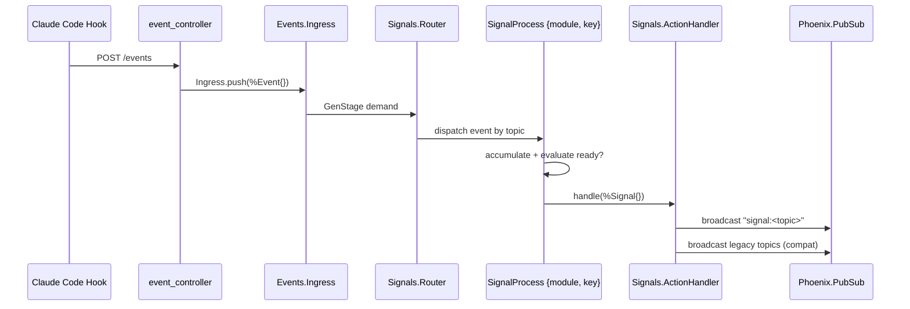
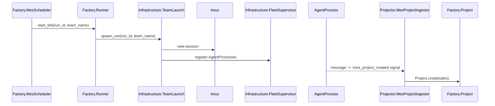

# Ichor (Host App) Refactor Analysis

## Overview

The host app is the composition root. It owns: the Phoenix web layer, the ADR-026 GenStage
signal pipeline, agent fleet GenServers, the Factory/MES runtime, monitoring projectors, and
Archon (the AI floor manager). It contains ~179 .ex files across 6 Ash Domains.

**Architecture as of 2026-03-25:**
- ADR-026 GenStage pipeline is live: `Events.Ingress` (producer) -> `Signals.Router` (consumer) -> `Signals.SignalProcess` per {module, key}
- `Ichor.Signal` macro provides `use Ichor.Signal` for declarative signal module definition
- `Projector/` namespace: all reactive GenServers that subscribe to Signals (replaced old Monitor + Gateway GenServers)
- `Infrastructure/` namespace: fleet adapters, team launch, agent processes (replaced old Fleet + Gateway namespaces)
- Frontend component library: `IchorWeb.UI` (button, input, label, select) and `IchorWeb.Components.Primitives`
- Supervision tree: `RuntimeSupervisor` owns Registry + ProcessSupervisor + pipeline; `Signals.PipelineSupervisor` uses rest_for_one

---

## Module Inventory

### Core Infrastructure

| Module | File | Lines | Type | Purpose |
|--------|------|-------|------|---------|
| `Ichor.Application` | application.ex | ~100 | Other | OTP start, supervision tree root |
| `Ichor.RuntimeSupervisor` | runtime_supervisor.ex | ~40 | Other | Shared runtime: Registry, ProcessSupervisor, PubSub bridge |
| `Ichor.MemoryStore` | memory_store.ex | ~500 | GenServer | Agent memory system (blocks, recall, archival) |
| `Ichor.Notes` | notes.ex | ~60 | GenServer | Operator note store (ETS-backed) |
| `Ichor.Signal` | signal.ex | ~60 | Macro | `use Ichor.Signal` declarative signal module definition |
| ~~`Ichor.CoreSupervisor`~~ | ~~core_supervisor.ex~~ | - | - | DELETED -- absorbed into application.ex |
| ~~`Ichor.GatewaySupervisor`~~ | ~~gateway_supervisor.ex~~ | - | - | DELETED -- gateway namespace dissolved |
| ~~`Ichor.ObservationSupervisor`~~ | ~~observation_supervisor.ex~~ | - | - | DELETED |
| ~~`Ichor.MonitorSupervisor`~~ | ~~monitor_supervisor.ex~~ | - | - | DELETED -- projectors started directly |
| ~~`Ichor.EventBuffer`~~ | ~~event_buffer.ex~~ | - | - | DELETED -- absorbed into `Signals.EventStream` |
| ~~`Ichor.EventJanitor`~~ | ~~event_janitor.ex~~ | - | - | DELETED -- ETS eviction handled within EventStream |
| ~~`Ichor.MemoriesBridge`~~ | ~~memories_bridge.ex~~ | - | - | DELETED -- absorbed into `Projector.MesResearchIngestor` |
| ~~`Ichor.Heartbeat`~~ | ~~heartbeat.ex~~ | - | - | DELETED -- absorbed into `Projector.AgentWatchdog` |
| ~~`Ichor.Channels`~~ | ~~channels.ex~~ | - | - | DELETED |
| ~~`Ichor.MapHelpers`~~ | ~~map_helpers.ex~~ | - | - | DELETED -- inlined at call sites |
| ~~`Ichor.Mailer`~~ | ~~mailer.ex~~ | - | - | DELETED |

### Gateway (DISSOLVED)

The `Ichor.Gateway` namespace has been fully dissolved. Modules were either deleted or moved:

- **Moved to `Ichor.Infrastructure`**: `HITLRelay` -> `Infrastructure.HITLRelay`, `OutputCapture` -> `Infrastructure.OutputCapture`, `TmuxDiscovery` -> `Infrastructure.TmuxDiscovery`, `CronScheduler` -> `Infrastructure.CronScheduler`, `WebhookDelivery` -> `Infrastructure.WebhookDelivery`
- **Moved to `Ichor.Signals.Agent`**: `EntropyTracker` -> `Signals.Agent.Entropy` (now a GenStage Signal accumulator, not a GenServer)
- **Moved to `Ichor.Signals`**: `HITLInterventionEvent` -> `Signals.HITLInterventionEvent`
- **Deleted**: `EventBridge`, `SchemaInterceptor`, `HeartbeatManager`, `CapabilityMap`, `WebhookRouter`, `TopologyBuilder`, `Envelope`, `Target`, `HitlEvents`, `HeartbeatRecord`, all `Channels.*` modules
- **Deleted**: `Router`, `Router.Audit`, `Router.Delivery`, `Router.EventIngest`, `Router.RecipientResolver` (delivery pipeline replaced by `Infrastructure.AgentDelivery` + `Infrastructure.AgentBackend`)

The inbound event ingestion path is now: HTTP POST /events -> `Events.Ingress.push/1` -> GenStage -> `Signals.Router` -> `Signals.SignalProcess`.

### Fleet (DISSOLVED -> Infrastructure)

The `Ichor.Fleet` namespace has been fully dissolved. Surviving modules were moved to `Ichor.Infrastructure`:

| Old Module | New Location |
|------------|-------------|
| `Fleet.FleetSupervisor` | `Infrastructure.FleetSupervisor` |
| `Fleet.TeamSupervisor` | `Infrastructure.TeamSupervisor` |
| `Fleet.AgentProcess` | `Infrastructure.AgentProcess` |
| `Fleet.HostRegistry` | `Infrastructure.HostRegistry` |
| `Fleet.Lifecycle.AgentLaunch` | `Infrastructure.AgentLaunch` |
| `Fleet.Lifecycle.TeamLaunch` | `Infrastructure.TeamLaunch` |
| `Fleet.Lifecycle.Registration` | `Infrastructure.Registration` |
| `Fleet.Lifecycle.Cleanup` | `Infrastructure.Cleanup` |
| `Fleet.Analysis.Queries` | `Workshop.Analysis.Queries` |
| `Fleet.Analysis.AgentHealth` | `Workshop.Analysis.AgentHealth` |
| `Fleet.Preparations.LoadAgents` | `Workshop.Preparations.LoadAgents` |
| `Fleet.Preparations.LoadTeams` | `Workshop.Preparations.LoadTeams` |

**Deleted** (not migrated): `Fleet.Runtime`, `Fleet.RuntimeView`, `Fleet.RuntimeQuery`, `Fleet.RuntimeHooks`, `Fleet.Lifecycle` (facade), `Fleet.Overseer`, `Fleet.Comms`, `Fleet.Queries`, `Fleet.Lookup`, `Fleet.SessionEviction`, `Fleet.Analysis.SessionEviction`, `Fleet.Session` (Ash resource), `Fleet.Preparations.LoadSessions`

The `AgentRegistryProjection` module is new: it extracts registry metadata projection logic from `AgentProcess` for testability.

### Monitoring (DISSOLVED -> Projector)

The `Ichor.Monitor*` namespace and several standalone monitoring GenServers were consolidated
into the `Ichor.Projector` namespace. All projectors are signal-driven GenServers.

| New Module | Replaces |
|------------|---------|
| `Projector.AgentWatchdog` | `AgentMonitor` + `NudgeEscalator` + `PaneMonitor` + `Heartbeat` |
| `Projector.CleanupDispatcher` | `Factory.Subscribers.RunCleanupDispatcher` + `Infrastructure.Subscribers.SessionCleanupDispatcher` + `Infrastructure.Subscribers.SessionLifecycle` |
| `Projector.FleetLifecycle` | `Infrastructure.Subscribers.SessionLifecycle` |
| `Projector.ProtocolTracker` | `ProtocolTracker` (moved, same purpose) |
| `Projector.SignalBuffer` | `Signals.Buffer` (moved, same purpose) |
| `Projector.SignalManager` | `Archon.SignalManager` (moved) |
| `Projector.TeamWatchdog` | `Archon.TeamWatchdog` (moved) |
| `Projector.MesProjectIngestor` | `Mes.ProjectIngestor` (moved) |
| `Projector.MesResearchIngestor` | `Mes.ResearchIngestor` + `MemoriesBridge` (moved + merged) |

**Deleted** (not migrated): `SwarmMonitor` and all submodules (`Analysis`, `Actions`, `Discovery`, `Health`, `Projects`, `StateBus`, `TaskState`), `QualityGate`

### MES (Manufacturing Execution System)

### MES / Factory (current state)

The MES namespace was dissolved into the `Factory` Ash Domain. The table below shows the current state.

| Module | File | Purpose |
|--------|------|---------|
| `Ichor.Factory.Runner` | factory/runner.ex | MES/pipeline run lifecycle GenServer |
| `Ichor.Factory.MesScheduler` | factory/mes_scheduler.ex | Pause/resume/status API (Oban tick) |
| `Ichor.Factory.CompletionHandler` | factory/completion_handler.ex | DAG completion -> next stage |
| `Ichor.Factory.Spawn` | factory/spawn.ex | Planning/pipeline team launch + cleanup |
| `Ichor.Factory.Loader` | factory/loader.ex | Loads project/pipeline data |
| `Ichor.Factory.ResearchContext` | factory/research_context.ex | Research context builder |
| ~~`Ichor.Mes.TeamSpawner`~~ | ~~mes/team_spawner.ex~~ | DELETED -- 23-line pure delegate, callers use Infrastructure directly |
| ~~`Ichor.Mes.TeamLifecycle`~~ | ~~mes/team_lifecycle.ex~~ | DELETED -- absorbed into Infrastructure.TeamLaunch |
| ~~`Ichor.Mes.TeamSpecBuilder`~~ | ~~mes/team_spec_builder.ex~~ | DELETED -- absorbed into Workshop.TeamSpec |
| ~~`Ichor.Mes.TeamCleanup`~~ | ~~mes/team_cleanup.ex~~ | DELETED |
| ~~`Ichor.Mes.Janitor`~~ | ~~mes/janitor.ex~~ | DELETED -- absorbed into Projector.TeamWatchdog |
| ~~`Ichor.Mes.ProjectIngestor`~~ | ~~mes/project_ingestor.ex~~ | MOVED to `Projector.MesProjectIngestor` |
| ~~`Ichor.Mes.ResearchIngestor`~~ | ~~mes/research_ingestor.ex~~ | MOVED to `Projector.MesResearchIngestor` |
| ~~`Ichor.Mes.ResearchStore`~~ | ~~mes/research_store.ex~~ | DELETED |
| ~~`Ichor.Mes.SubsystemLoader`~~ | ~~mes/subsystem_loader.ex~~ | DELETED |
| ~~`Ichor.Mes.SubsystemScaffold`~~ | ~~mes/subsystem_scaffold.ex~~ | DELETED -- plugin scaffolding now in Factory.PluginScaffold |
| ~~`Ichor.Mes.Supervisor`~~ | ~~mes/supervisor.ex~~ | DELETED -- lifecycle managed by application.ex |

**Note on prompts**: `Workshop.TeamPrompts` covers MES agent role prompts. `Factory.PlanningPrompts` covers planning modes.

### Genesis Pipeline (current state)

Genesis pipeline is now integrated into the `Factory` domain. The old `Ichor.Genesis` namespace
survives as the ADR/Feature/Task/Phase Ash resource layer. The old GenServer runners were merged
into `Factory.Runner`.

Surviving genesis modules (Ash resources, not GenServers): `Factory.Pipeline`, `Factory.PipelineTask`, `Factory.Artifact`, `Factory.RoadmapItem`, `Factory.Board`

~~`Ichor.Genesis.Supervisor`~~, ~~`Ichor.Genesis.ModeRunner`~~, ~~`Ichor.Genesis.ModeSpawner`~~, ~~`Ichor.Genesis.RunProcess`~~ -- all DELETED.

`Factory.PipelineCompiler` replaces `Genesis.PipelineCompiler`. `Factory.PipelineGraph` replaces `Dag.Graph`. `Factory.Validator` replaces `Dag.Validator`. `Factory.Loader` replaces `Dag.Loader`.

### DAG Runtime (current state)

The `Ichor.Dag` namespace has been dissolved into the `Factory` domain.

~~`Ichor.Dag.Supervisor`~~, ~~`Ichor.Dag.RunSupervisor`~~, ~~`Ichor.Dag.RunProcess`~~, ~~`Ichor.Dag.Spawner`~~, ~~`Ichor.Dag.WorkerGroups`~~, ~~`Ichor.Dag.Loader`~~, ~~`Ichor.Dag.Graph`~~, ~~`Ichor.Dag.Validator`~~, ~~`Ichor.Dag.Exporter`~~, ~~`Ichor.Dag.HealthChecker`~~, ~~`Ichor.Dag.Prompts`~~, ~~`Ichor.Dag.RuntimeEventBridge`~~, ~~`Ichor.Dag.RuntimeSignals`~~ -- all DELETED or absorbed into Factory.

### Archon (AI Floor Manager -- current state)

Archon domain is now under `lib/ichor/archon/` with the reactive GenServers moved to `Projector/`.

| Module | File | Purpose |
|--------|------|---------|
| `Ichor.Archon.Chat` | archon/chat.ex | LLM-backed conversation engine |
| `Ichor.Archon.CommandManifest` | archon/command_manifest.ex | MCP command metadata source of truth |
| `Ichor.Archon.Manager` | archon/manager.ex | Ash action surface for Archon control |
| `Ichor.Archon.Memory` | archon/memory.ex | Ash resource for Archon memory access |
| ~~`Ichor.Archon.SignalManager`~~ | | MOVED to `Projector.SignalManager` |
| ~~`Ichor.Archon.TeamWatchdog`~~ | | MOVED to `Projector.TeamWatchdog` |
| ~~`Ichor.Archon.SignalManager.Reactions`~~ | | DELETED -- logic absorbed into Projector.SignalManager |
| ~~`Ichor.Archon.TeamWatchdog.Reactions`~~ | | DELETED -- logic absorbed into Projector.TeamWatchdog |
| ~~`Ichor.Archon.MemoriesClient`~~ | | MOVED to `Infrastructure.MemoriesClient` |
| ~~`Ichor.Archon.Tools.*`~~ | | DELETED -- Archon tools are now MCP tools via `mcp_profiles.ex` |

### MCP Agent Tools (DELETED)

The `Ichor.AgentTools` namespace (including `Inbox`, `Tasks`, `Memory`, `Recall`, `Archival`,
`Agents`, `Spawn`, `GenesisNodes`, `GenesisArtifacts`, `GenesisGates`, `GenesisRoadmap`,
`DagExecution`) was deleted. Agent tooling is now served via the Ichor MCP server and
`mcp_profiles.ex` which exposes Ash domain actions directly.

### Other Business Logic

The following modules were also deleted during consolidation:

- ~~`Ichor.Activity.EventAnalysis`~~ -- DELETED (activity feed now uses `Signals.EventStream`)
- ~~`Ichor.AgentSpawner`~~ -- DELETED (agent ID counter no longer needed)
- ~~`Ichor.Operator`~~ -- DELETED -- inbox replaced by `Operator.Inbox` file writer
- ~~`Ichor.TaskManager`~~ -- DELETED
- ~~`Ichor.InstructionOverlay`~~ -- DELETED
- ~~`Ichor.Costs`~~ / ~~`Ichor.Costs.CostAggregator`~~ -- DELETED
- ~~`Ichor.Tools.*`~~ (`AgentControl`, `GenesisFormatter`, `Messaging`) -- DELETED
- ~~`Ichor.Workshop.Launcher`~~ -- DELETED (absorbed into `Workshop.Spawn`)
- ~~`Ichor.QualityGate`~~ -- DELETED

### Web Layer (IchorWeb -- current state)

The LiveView handler split is unchanged. Deleted handlers are called out below.
New: `IchorWeb.UI` component library and `IchorWeb.Components.Primitives`.

| Module | Purpose |
|--------|---------|
| `IchorWeb.DashboardLive` | Root LiveView; event routing dispatcher |
| `IchorWeb.DashboardState` | `recompute/1` and `recompute_view/1`; orchestrates assigns |
| `IchorWeb.DashboardFeedHelpers` | Feed group building logic |
| `IchorWeb.DashboardFormatHelpers` | Formatting helpers (time, size, truncation) |
| `IchorWeb.DashboardDataHelpers` | filtered_events, filtered_sessions |
| `IchorWeb.DashboardAgentHelpers` | Agent task derivation |
| `IchorWeb.DashboardAgentActivityHelpers` | Agent event stream helpers |
| `IchorWeb.DashboardAgentHealthHelpers` | Agent health UI helpers |
| `IchorWeb.DashboardArchonHandlers` | Archon chat event handlers |
| `IchorWeb.DashboardFeedHandlers` | Feed collapse/expand handlers |
| `IchorWeb.DashboardFilterHandlers` | Filter event handlers |
| `IchorWeb.DashboardFleetTreeHandlers` | Fleet tree toggle handlers |
| `IchorWeb.DashboardInfoHandlers` | Info panel handler: genesis node detail |
| `IchorWeb.DashboardMesHandlers` | MES control panel event handlers |
| `IchorWeb.DashboardMessagingHandlers` | Messaging tab handlers |
| `IchorWeb.DashboardNavigationHandlers` | Navigation/view jump handlers |
| `IchorWeb.DashboardNotesHandlers` | Notes panel handlers |
| `IchorWeb.DashboardNotificationHandlers` | Toast/notification handlers |
| `IchorWeb.DashboardPipelineHandlers` | Pipeline board event handlers |
| `IchorWeb.DashboardSelectionHandlers` | Selection state handlers |
| `IchorWeb.DashboardSessionControlHandlers` | Pause/resume/shutdown/HITL handlers |
| `IchorWeb.DashboardSessionHelpers` | Session data helpers |
| `IchorWeb.DashboardSettingsHandlers` | Settings page handlers |
| `IchorWeb.DashboardSlideoutHandlers` | Agent slideout handlers |
| `IchorWeb.DashboardSpawnHandlers` | Agent spawn handlers |
| `IchorWeb.DashboardTaskHandlers` | Task CRUD handlers |
| `IchorWeb.DashboardTeamHelpers` | Team state computation |
| `IchorWeb.DashboardTmuxHandlers` | Tmux interaction handlers |
| `IchorWeb.DashboardToast` | Toast notification helpers |
| `IchorWeb.DashboardUIHandlers` | Generic UI toggle handlers |
| `IchorWeb.DashboardViewRouter` | Routes view_mode changes |
| `IchorWeb.DashboardWorkshopHandlers` | Workshop panel handlers |
| `IchorWeb.WorkshopPersistence` | Workshop state persistence |
| `IchorWeb.WorkshopTypes` | Workshop type definitions |
| `IchorWeb.UI` | Component library entry (button, input, label, select) |

**Deleted**: ~~`DashboardGatewayHandlers`~~ (gateway dissolved), ~~`DashboardSwarmHandlers`~~ (SwarmMonitor deleted), ~~`DashboardMesResearchHandlers`~~, ~~`DashboardPhase5Handlers`~~, ~~`DashboardTeamInspectorHandlers`~~, ~~`DashboardTimelineHelpers`~~, ~~`SessionDrilldownLive`~~, ~~`WorkshopPresets`~~ (moved to `Workshop.Presets` domain module)

---

## Architecture Diagrams

### Supervision Tree (current)

```mermaid
graph TD
    App[Ichor.Application]
    App --> PubSub[Phoenix.PubSub]
    App --> Registry[Ichor.Registry]
    App --> Oban[Oban]
    App --> HostReg[Infrastructure.HostRegistry]
    App --> Notes[Notes]
    App --> MemStore[MemoryStore]
    App --> Fleet[Infrastructure.FleetSupervisor]
    App --> Runtime[RuntimeSupervisor]
    App --> PipelineSup[Signals.PipelineSupervisor]
    App --> Projectors[Projector GenServers]
    App --> Factory[Factory.LifecycleSupervisor]
    App --> TaskSup[Task.Supervisor]
    App --> Web[IchorWeb.Endpoint]

    Runtime --> ProcSup[ProcessSupervisor]
    Runtime --> ProcessRegistry[ProcessRegistry]

    PipelineSup --> Ingress[Events.Ingress]
    PipelineSup --> Router[Signals.Router]

    Projectors --> AgentWD[Projector.AgentWatchdog]
    Projectors --> CleanupDisp[Projector.CleanupDispatcher]
    Projectors --> FleetLC[Projector.FleetLifecycle]
    Projectors --> SignalBuf[Projector.SignalBuffer]
    Projectors --> SignalMgr[Projector.SignalManager]
    Projectors --> TeamWD[Projector.TeamWatchdog]
    Projectors --> ProtoTrack[Projector.ProtocolTracker]
    Projectors --> MesProjIngest[Projector.MesProjectIngestor]
    Projectors --> MesResIngest[Projector.MesResearchIngestor]

    Fleet --> TeamSup1[TeamSupervisor per team]
    Fleet --> AgentProc[AgentProcess standalone]
```

### ADR-026 Event Flow (current)

### MES Pipeline Flow (current)

---

## Boundary Violations (current -- unresolved)

### HIGH: Direct Ash.create/update/destroy bypassing code_interface

1. `IchorWeb.DashboardWorkshopHandlers` (workshop_handlers.ex): `Ash.destroy!(bp)` directly.
   Should use Workshop domain code_interface.

2. `IchorWeb.WorkshopTypes` (workshop_types.ex): `Ash.destroy!(type)` directly.
   Should use Workshop domain code_interface.

3. `IchorWeb.Controllers.ExportController` (export_controller.ex): `Ash.read(Event, ...)` directly.
   Should use `Ichor.Events` domain code_interface.

### MEDIUM: LiveView calling resource modules directly (bypass Domain)

`IchorWeb.DashboardMesHandlers` aliases and calls Factory resources directly.
`DashboardInfoHandlers` calls Factory resources directly.
Actions should be accessed via domain code_interface, not module-level aliases.

### MEDIUM: MemoriesClient nested result modules

`Ichor.Infrastructure.MemoriesClient` still defines result structs (`IngestResult`,
`ChunkedIngestResult`, `SearchResult`, `QueryResult`) as structs in the same file. Should be
extracted to submodule files under `infrastructure/memories_client/`.

---

## Consolidation Plan (open items)

### Merge (too small, single caller)

~~1. `Ichor.Mes.TeamSpawner` -> remove~~ DONE
~~2. `Ichor.Fleet.Lifecycle` -> remove~~ DONE

4. **`Ichor.Fleet.SessionEviction` vs `Fleet.Analysis.SessionEviction`**: Likely duplicate.
   Should be one module under `Analysis`.

### Split (too large, multiple responsibilities)

1. **`IchorWeb.DashboardFeedHelpers`**: Feed group building logic. May still be large -- audit line count.

2. **`Ichor.MemoryStore`**: Still a large GenServer body. Evaluate if ETS reads can bypass
   the GenServer (reads are concurrent on public tables).

3. **`Ichor.Workshop.TeamPrompts`**: Pure prompt strings. May warrant splitting by role.

4. **`Ichor.Factory.PlanningPrompts`**: Pure prompt strings. May warrant splitting by mode A/B/C.

5. ~~**`Ichor.Archon.MemoriesClient` nested modules**~~ -- moved to `Infrastructure.MemoriesClient`,
   nested structs still need extraction to own files.

6. ~~**`Ichor.Mesh.DecisionLog`**~~ -- DELETED
7. ~~**`Ichor.Gateway.SchemaInterceptor`**~~ -- DELETED
8. ~~**`Ichor.Dag.Prompts`**~~ -- DELETED (DAG namespace dissolved)
9. ~~**`Ichor.Genesis.PlanningPrompts`**~~ -- absorbed into `Factory.PlanningPrompts`

### Dead Code

1. **`Ichor.Projector.ProtocolTracker.compute_stats/0`**: The `command_queue.sessions` and
   `command_queue.total_pending` fields always return 0. Dead code path.

2. ~~**`subscribe_gateway_topics/0` no-op**~~ -- `DashboardGatewayHandlers` was deleted.
3. ~~**`AgentMonitor` vs `NudgeEscalator` overlap**~~ -- both deleted; absorbed into `Projector.AgentWatchdog`.
4. ~~**`Fleet.AgentProcess.Registry.fields_from_event/1`**~~ -- Fleet namespace dissolved.
5. ~~**`Fleet.SessionEviction` vs `Fleet.Analysis.SessionEviction` duplication**~~ -- Fleet namespace dissolved.

---

## Priority (open items as of 2026-03-25)

### HIGH (correctness + principle violations)

- [ ] Extract result structs from `Infrastructure.MemoriesClient` into own files
- [ ] Fix `DashboardWorkshopHandlers` to use Workshop code_interface (not `Ash.destroy!` directly)
- [ ] Fix `WorkshopTypes` to use Workshop code_interface (not `Ash.destroy!` directly)
- [ ] Fix `ExportController` to use `Ichor.Events` domain code_interface

### MEDIUM (maintainability)

- [ ] Split `DashboardFeedHelpers` if > 300L after recent changes
- [ ] Audit `Workshop.TeamPrompts` line count; split by role if > 200L
- [ ] `MemoryStore` GenServer: evaluate if ETS public reads can bypass GenServer serialization

### LOW (cleanup)

- [ ] Remove dead `ProtocolTracker.compute_stats` command_queue fields (always return 0)
