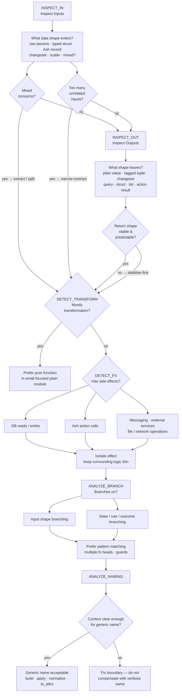

# AGENT_PROMPT Decision Framework — True DAG

> **Source:** `SPECS/dag/AGENT_PROMPT.md`
> **Machine-readable companion:** `SPECS/dag/agent_prompt_dag.yml`

---

## Why this is a true DAG, not a heading outline

The source document is not just a hierarchy of sections—it is a **decision framework** whose
sections have implicit routing relationships:

- Inspection steps feed forward and contain early-exit branches (if a function is *mostly
  transformation*, routing goes directly to a terminal recommendation without continuing).
- Multiple constraint nodes (heuristics, style rules, Ash expectations, boundary model) all
  converge on a single classification node, creating a many-to-one dependency pattern that a
  heading tree cannot express.
- Three separate paths (from `DETECT_TRANSFORM`, from `CLASSIFY`, and from `DECISION_RULE`) all
  reach the same terminal placement nodes, creating a directed graph with convergent paths.
- `DECISION_RULE` is a fallback node that receives from `CLASSIFY` and fans out to all three
  terminals—a routing node that has no analogue in a section tree.
- `REVIEW` is a convergence node receiving from all three terminals and feeding the
  output format stage, representing validation *after* placement.

The graph is acyclic: every edge moves from earlier-in-reasoning to later-in-reasoning. No path
can revisit a node it has already passed through.

---

## Node categories

| Symbol in diagram | Category        | Meaning                                                       |
|-------------------|-----------------|---------------------------------------------------------------|
| `([ ])`           | **Entry**       | Where reasoning begins                                        |
| `[ ]`             | **Inspection**  | Evidence-collection: examines a property of the function      |
| `{ }`             | **Decision**    | Branching point: yes/no or multi-way route                    |
| `[[ ]]`           | **Constraint**  | Governing rule applied during classification                  |
| `[ ]` (routing)   | **Routing**     | Intermediate step that normalises or redirects the path       |
| `([ ])`           | **Terminal**    | Final placement recommendation                                |
| `(( ))`           | **Output**      | Response-format or operating-standard requirement             |

---

## How to traverse the graph

1. **Start** at `START` — a code artefact has been submitted for refactoring.
2. **Frame** the task using `CORE_OBJ` (target qualities) and `PRIME_RULE` (shape over name).
3. **Inspect** the function sequentially:
   - `INSPECT_IN` → `INSPECT_OUT` → `DETECT_TRANSFORM`
   - If transformation is detected early, route directly to `PLACE_PLAIN`.
   - Otherwise continue to `DETECT_FX`.
4. **Side effects:** if present, apply `ISOLATE_FX`, then proceed to `ANALYZE_BRANCH`.
5. **Branching & naming:** work through `ANALYZE_BRANCH` → `PREFER_PATTERNS` → `ANALYZE_NAMING`.
6. **Classify** at `CLASSIFY`, where all constraint nodes (`SHAPE_DOCTRINE`, `REFACTOR_HEURISTICS`,
   `CODE_STYLE`, `ASH_EXPECT`, `BOUNDARY_MODEL`) converge.
7. **Route** to one of three terminals, or to `DECISION_RULE` when the classification is
   uncertain.
8. **Validate** the chosen placement at `REVIEW`.
9. **Output** a structured response following `OUTPUT_FORMAT`, governed by `FINAL_STD`.

---

## Terminal placement decision criteria

| Terminal            | Route here when…                                                                                        |
|---------------------|---------------------------------------------------------------------------------------------------------|
| `PLACE_RESOURCE`    | Logic is about entity rules, persistence-facing invariants, validations, changes, policies, actions tightly coupled to the entity. |
| `PLACE_DOMAIN`      | Logic is orchestration: deciding step order, coordinating resources, calling multiple actions, exposing business capabilities. |
| `PLACE_PLAIN`       | Logic is pure transformation: cleaning params, normalising inputs, mapping structs, deriving values, converting shapes, simple non-persistent validation. |

The `DECISION_RULE` fallback: *when uncertain, choose the design where function shapes stay
simple and Ash boundaries become more obvious.*

---

## Main DAG

```mermaid
graph TD

    %% ── Entry ────────────────────────────────────────────────
    START(["▶ START\nReceive code to refactor"])

    %% ── Framing / context ────────────────────────────────────
    CORE_OBJ["CORE_OBJ\nCore Objective\nsmall · explicit · composable · idiomatic\nhonest about side-effects · Ash-aligned"]
    PRIME_RULE["PRIME_RULE\nPrime Rule\nJudge by shape, not name\n— input · output · side-effect boundary"]

    %% ── Inspection pipeline ──────────────────────────────────
    INSPECT_IN["INSPECT_IN\nInspect Inputs\ndata shape · raw params vs typed structs\nmixed concerns? · too many unrelated inputs?"]
    INSPECT_OUT["INSPECT_OUT\nInspect Outputs\nreturn shape · plain value vs tagged tuple\nvs changeset · stability · predictability"]
    DETECT_TRANSFORM{"DETECT_TRANSFORM\nMostly\ntransformation?"}
    DETECT_FX{"DETECT_FX\nHas side\neffects?\nDB · Ash · messaging · external · file/net"}
    ISOLATE_FX["ISOLATE_FX\nIsolate Effect\nkeep surrounding logic thin"]
    ANALYZE_BRANCH["ANALYZE_BRANCH\nAnalyze Branching\nbranches on: input shape · state · rule · outcome"]
    PREFER_PATTERNS["PREFER_PATTERNS\nPrefer Pattern Matching\nmultiple fn heads · guards · tagged tuples\nover nested case / boolean soup"]
    ANALYZE_NAMING["ANALYZE_NAMING\nAnalyze Naming\nIs context — module · types · return shape —\nclear enough for a generic name?"]

    %% ── Constraint nodes ─────────────────────────────────────
    SHAPE_DOCTRINE[["SHAPE_DOCTRINE\nFunction-Shape Doctrine\nunderstandable from module + name\n+ arity + params + return"]]
    REFACTOR_HEURISTICS[["REFACTOR_HEURISTICS\nRefactor Heuristics\n9 shape-driven rules\norchestration vs transformation\nResource / Domain / Plain split"]]
    CODE_STYLE[["CODE_STYLE\nCode Style Rules\nsmall fns · pattern-match first\npipelines when readable · no nested case"]]
    ASH_EXPECT[["ASH_EXPECT\nAsh-specific Expectations\nresource boundaries · action naming\nvalidations · policies · domain entry points"]]
    BOUNDARY_MODEL[["BOUNDARY_MODEL\nBoundary Mental Model\nResource = entity rules\nDomain = business goals\nPlain = transformation"]]

    %% ── Classification ───────────────────────────────────────
    CLASSIFY{"CLASSIFY\nClassify Function\norchestration?\nentity rule?\npure transformation?"}

    %% ── Fallback routing ─────────────────────────────────────
    DECISION_RULE["DECISION_RULE\nDecision Rule\nWhen uncertain: choose simpler shapes\n+ clearer Ash boundaries"]

    %% ── Validation ───────────────────────────────────────────
    REVIEW["REVIEW\nReview Discipline\nper function: shape · effect type\norchestration? · entity rule?\nplacement correct?"]

    %% ── Terminal recommendations ─────────────────────────────
    PLACE_RESOURCE(["✅ PLACE_RESOURCE\nAsh Resource\nentity rules · validations · changes\nactions · policies · persistence"])
    PLACE_DOMAIN(["✅ PLACE_DOMAIN\nDomain Module\nbusiness capabilities · orchestration\ncoordination · public entry points"])
    PLACE_PLAIN(["✅ PLACE_PLAIN\nPlain Elixir Module\npure transformation · normalisation\nshape conversion · non-Ash helpers"])

    %% ── Output requirements ──────────────────────────────────
    OUTPUT_FORMAT(("OUTPUT_FORMAT\nRequired Output Format\n1 boundary changes\n2 classification\n3 refactored code\n4 assumptions\n5 preserved behaviour"))
    FINAL_STD(("FINAL_STD\nFinal Operating Standard\nstable shapes · obvious boundaries\nidiomatic Elixir + Ash\ncheap future change · low entropy"))

    %% ═══════════════════════════════════════════════════════
    %% EDGES
    %% ═══════════════════════════════════════════════════════

    %% Framing
    START --> CORE_OBJ
    START --> PRIME_RULE

    %% Prime rule and objective enable shape-first inspection
    PRIME_RULE -->|"shape-first"| INSPECT_IN
    CORE_OBJ   -->|"governs"| INSPECT_IN

    %% Inspection pipeline
    INSPECT_IN  --> INSPECT_OUT
    INSPECT_OUT --> DETECT_TRANSFORM

    %% Transformation early-exit
    DETECT_TRANSFORM -->|"yes → pure fn"| PLACE_PLAIN
    DETECT_TRANSFORM -->|"no"| DETECT_FX

    %% Side-effect branch
    DETECT_FX -->|"yes"| ISOLATE_FX
    DETECT_FX -->|"no"| ANALYZE_BRANCH
    ISOLATE_FX --> ANALYZE_BRANCH

    %% Branching and naming
    ANALYZE_BRANCH   --> PREFER_PATTERNS
    PREFER_PATTERNS  --> ANALYZE_NAMING
    ANALYZE_NAMING   --> CLASSIFY

    %% Constraints converge on classification
    SHAPE_DOCTRINE      -->|"constrains"| CLASSIFY
    REFACTOR_HEURISTICS -->|"constrains"| CLASSIFY
    CODE_STYLE          -->|"constrains"| CLASSIFY
    ASH_EXPECT          -->|"constrains"| CLASSIFY
    BOUNDARY_MODEL      -->|"constrains"| CLASSIFY

    %% Classification routes
    CLASSIFY -->|"orchestration / coordination"| PLACE_DOMAIN
    CLASSIFY -->|"entity rule / persistence"| PLACE_RESOURCE
    CLASSIFY -->|"pure transformation"| PLACE_PLAIN
    CLASSIFY -->|"uncertain"| DECISION_RULE

    %% Decision rule fallback fans out
    DECISION_RULE -->|"domain fit"| PLACE_DOMAIN
    DECISION_RULE -->|"resource fit"| PLACE_RESOURCE
    DECISION_RULE -->|"simplest shape"| PLACE_PLAIN

    %% All terminals feed review
    PLACE_RESOURCE --> REVIEW
    PLACE_DOMAIN   --> REVIEW
    PLACE_PLAIN    --> REVIEW

    %% Review feeds output
    REVIEW --> OUTPUT_FORMAT
    OUTPUT_FORMAT --> FINAL_STD
```



---

## Expanded inspection sub-DAG

The six inspection steps contain their own internal checks. This sub-DAG makes them explicit.



---

## Refactor heuristics sub-DAG

The nine refactor heuristics each feed into specific classification outcomes.

```mermaid
graph TD

    RH["REFACTOR_HEURISTICS"]

    H1["H1 · Prefer shape-driven design\ndesign by input / output / effect clarity"]
    H2["H2 · Separate orchestration from transformation\norchestration → Domain\ntransformation → Plain module\nentity rules → Resource"]
    H3["H3 · Keep resources honest\nmodel entity rules · DSL where natural\nplain Elixir when clearer"]
    H4["H4 · Keep domains thin but meaningful\nexpose capabilities · coordinate · not a blob"]
    H5["H5 · Prefer small pure helpers\nextract when: reduce duplication · clarify intent\nstabilise shape · improve testability"]
    H6["H6 · Prefer multiple function heads\npattern matching · guards · tagged tuples\navoid nested case / boolean chains"]
    H7["H7 · Respect data shape transitions\nparams→attrs · attrs→changeset\nrecord→DTO · external→tagged tuple"]
    H8["H8 · Use Ash idiomatically\npersistence → Resource · business ops → Domain\nactions intentional · no bypass without reason"]
    H9["H9 · Optimise for maintainability\nsmaller modules · stable interfaces\nfew hidden effects · low coupling"]

    PLACE_DOMAIN(["PLACE_DOMAIN"])
    PLACE_RESOURCE(["PLACE_RESOURCE"])
    PLACE_PLAIN(["PLACE_PLAIN"])

    RH --> H1
    RH --> H2
    RH --> H3
    RH --> H4
    RH --> H5
    RH --> H6
    RH --> H7
    RH --> H8
    RH --> H9

    H1 --> PLACE_PLAIN
    H1 --> PLACE_RESOURCE
    H1 --> PLACE_DOMAIN

    H2 -->|"orchestration"| PLACE_DOMAIN
    H2 -->|"transformation"| PLACE_PLAIN
    H2 -->|"entity rules"| PLACE_RESOURCE

    H3 --> PLACE_RESOURCE
    H4 --> PLACE_DOMAIN
    H5 --> PLACE_PLAIN

    H6 --> PLACE_PLAIN
    H6 --> PLACE_RESOURCE

    H7 --> PLACE_PLAIN

    H8 -->|"entity persistence"| PLACE_RESOURCE
    H8 -->|"business ops"| PLACE_DOMAIN

    H9 --> PLACE_PLAIN
    H9 --> PLACE_DOMAIN
    H9 --> PLACE_RESOURCE
```



---

## Adjacency summary (text form)

For quick reference, every directed edge in the main DAG:

```
START              → CORE_OBJ, PRIME_RULE
PRIME_RULE         → INSPECT_IN
CORE_OBJ           → INSPECT_IN
INSPECT_IN         → INSPECT_OUT
INSPECT_OUT        → DETECT_TRANSFORM
DETECT_TRANSFORM   → PLACE_PLAIN (yes), DETECT_FX (no)
DETECT_FX          → ISOLATE_FX (yes), ANALYZE_BRANCH (no)
ISOLATE_FX         → ANALYZE_BRANCH
ANALYZE_BRANCH     → PREFER_PATTERNS
PREFER_PATTERNS    → ANALYZE_NAMING
ANALYZE_NAMING     → CLASSIFY
SHAPE_DOCTRINE     → CLASSIFY
REFACTOR_HEURISTICS→ CLASSIFY
CODE_STYLE         → CLASSIFY
ASH_EXPECT         → CLASSIFY
BOUNDARY_MODEL     → CLASSIFY
CLASSIFY           → PLACE_DOMAIN (orchestration)
                   → PLACE_RESOURCE (entity rule)
                   → PLACE_PLAIN (pure transformation)
                   → DECISION_RULE (uncertain)
DECISION_RULE      → PLACE_DOMAIN, PLACE_RESOURCE, PLACE_PLAIN
PLACE_RESOURCE     → REVIEW
PLACE_DOMAIN       → REVIEW
PLACE_PLAIN        → REVIEW
REVIEW             → OUTPUT_FORMAT
OUTPUT_FORMAT      → FINAL_STD
```
