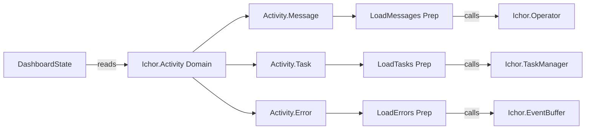

# ichor_activity Refactor Analysis

## Overview

Small Ash domain. Three resources: Message, Task, Error. Each resource uses a custom
Preparation to load data from external sources (ETS event buffer, Redis-style stores)
rather than a database table. Total: 7 files, ~339 lines.

---

## Module Inventory

| Module | File | Lines | Type | Purpose |
|--------|------|-------|------|---------|
| `Ichor.Activity` | activity.ex | 10 | Ash Domain | Domain root for Message, Task, Error |
| `Ichor.Activity.Message` | activity/message.ex | 29 | Ash Resource | Agent messages (no DB; read via preparation) |
| `Ichor.Activity.Task` | activity/task.ex | 29 | Ash Resource | Agent tasks (no DB; read via preparation) |
| `Ichor.Activity.Error` | activity/error.ex | 54 | Ash Resource | Agent errors (no DB; read via preparation) |
| `Ichor.Activity.Preparations.LoadMessages` | activity/preparations/load_messages.ex | 82 | Preparation | Loads messages from Operator message log |
| `Ichor.Activity.Preparations.LoadTasks` | activity/preparations/load_tasks.ex | 88 | Preparation | Loads tasks from TaskManager (tasks.jsonl) |
| `Ichor.Activity.Preparations.LoadErrors` | activity/preparations/load_errors.ex | 47 | Preparation | Loads errors from EventBuffer |

---

## Cross-References

### Called by
- `IchorWeb.DashboardState` calls `Ichor.Activity.{Error,Message,Task}` via domain reads during `recompute/1`
- `Ichor.Activity.EventAnalysis` (in ichor/) imports `Ichor.Activity.*` structs for analysis

### Calls out to
- `LoadMessages` -> `Ichor.Operator.recent_messages/1` (ichor app)
- `LoadTasks` -> `Ichor.TaskManager.list_tasks/1` (ichor app)
- `LoadErrors` -> `Ichor.EventBuffer.list_events/0` (ichor app)

All three preparations call back into the host ichor app. This is a compile-time dependency
on the host: `ichor_activity` depends on `ichor`. This is backwards from typical umbrella
patterns where leaf apps should not depend on the root. However, since this is an umbrella
with shared compilation context, it works at runtime.

---

## Architecture

---

## Boundary Violations

### MEDIUM: Preparations call back into host app

`LoadMessages`, `LoadTasks`, and `LoadErrors` all call into ichor host modules. This creates
a dependency cycle in spirit (ichor_activity depends on ichor). While Elixir umbrella apps
share compilation at the project level, this pattern makes ichor_activity non-independently
testable and tightly couples it to the host implementation.

**Recommended fix**: These preparations should accept a callback or receive data via an
injected function/behaviour rather than calling host modules directly. Alternatively,
move the preparations INTO the ichor host app since they are host-specific.

### LOW: Resources have no data layer (atypical Ash usage)

All three resources use custom preparations without a data layer. This is valid Ash usage
but means there are no standard CRUD actions, no policies, and no identities. Document this
explicitly in `@moduledoc` so future contributors understand the pattern.

---

## Consolidation Plan

### Do not merge
All 7 modules serve clear distinct purposes. The domain is well-sized.

### Consider moving
`LoadMessages`, `LoadTasks`, `LoadErrors` could move to `ichor/lib/ichor/activity/` since
they call host modules and are host-specific. This would make `ichor_activity` a pure schema
app (just resource structs) that the host populates.

### Naming
`Ichor.Activity.EventAnalysis` lives in the host app (`ichor/lib/ichor/activity/event_analysis.ex`)
but is in the `Ichor.Activity` namespace. This is confusing -- it belongs to `ichor`, not
`ichor_activity`. Consider moving to `Ichor.Gateway.EventAnalysis` or `Ichor.Events.Analysis`.

---

## Priority

### LOW (this app is clean, small, well-structured)

- [ ] Document the "no data layer" pattern in each resource's `@moduledoc`
- [ ] Consider relocating preparations to host app to break reverse dependency
- [ ] Rename `Ichor.Activity.EventAnalysis` (in host) to avoid namespace confusion
