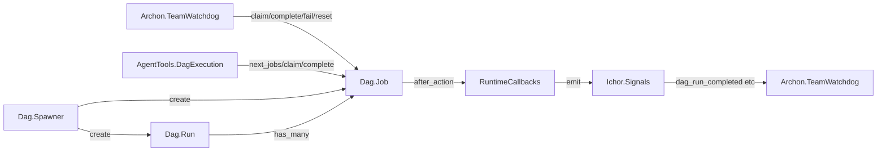
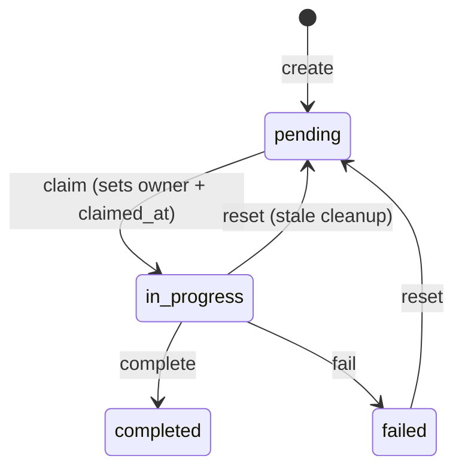

# ichor_dag Refactor Analysis

## Overview

The DAG Ash domain. Two resources: Run and Job. Owns the canonical data model for DAG
execution sessions and their claimable jobs. RuntimeCallbacks hooks signal emission into
Ash after_action hooks. Total: 6 files, ~499 lines.

---

## Module Inventory

| Module | File | Lines | Type | Purpose |
|--------|------|-------|------|---------|
| `Ichor.Dag` | dag.ex | 18 | Ash Domain | Domain root for Run and Job |
| `Ichor.Dag.Run` | dag/run.ex | 123 | Ash Resource | DAG execution session (SQLite) |
| `Ichor.Dag.Job` | dag/job.ex | 249 | Ash Resource | Claimable execution unit (SQLite) |
| `Ichor.Dag.Job.Preparations.FilterAvailable` | dag/job/preparations/filter_available.ex | 41 | Preparation | Filters jobs by completed dependencies |
| `Ichor.Dag.RuntimeCallbacks` | dag/runtime_callbacks.ex | 27 | Change | after_action signal hooks for job transitions |
| `Ichor.Dag.Handoff` | dag/handoff.ex | 41 | Pure Function | Handoff data struct for DAG completion events |

---

## Cross-References

### Called by (from ichor host app)
- `Ichor.Archon.TeamWatchdog` -> `Ichor.Dag.{Job,Run}` (direct code_interface)
- `Ichor.Dag.Spawner` -> `Ichor.Dag.{Job,Run}` (code_interface)
- `Ichor.Dag.RunProcess` -> `Ichor.Dag.{Job,Run}` (code_interface)
- `Ichor.AgentTools.DagExecution` -> `Ichor.Dag.{Job,Run}` (code_interface)
- `IchorWeb.DashboardSwarmHandlers` -> `Ichor.Dag.{Job,Run}` (code_interface)

### Calls out to (from ichor_dag)
- `Ichor.Dag.RuntimeCallbacks` -> `Ichor.Signals.emit/2` (via ichor_signals)

---

## Architecture



### Job Status Lifecycle



---

## Boundary Violations

### MEDIUM: `RuntimeCallbacks` uses after_action inline closures

`Ichor.Dag.Job` uses anonymous function callbacks in after_action hooks:

```elixir
change(
  after_action(fn _changeset, result, _context ->
    RuntimeCallbacks.after_job_transition(result, :job_claimed)
  end)
)
```

This is the required pattern for Ash after_action callbacks with external delegates, but
the anonymous closure means the callback is not composable or independently testable.
Consider extracting as a named `Ash.Resource.Change` module that delegates to RuntimeCallbacks.

### LOW: `Job.now/0` is a public function only used for `claimed_at`/`completed_at` defaults

`Ichor.Dag.Job.now/0` (dag/job.ex:248) is `@doc false` but public, called via
`set_attribute(:claimed_at, &__MODULE__.now/0)`. This is required by Ash DSL for MFA syntax
but is confusing. Document clearly.

### LOW: `FilterAvailable` preparation filters in Elixir after DB load

`Ichor.Dag.Job.Preparations.FilterAvailable` (filter_available.ex) loads all pending+unowned
jobs from the DB then applies Elixir-side filtering for `blocked_by` completion. This is
correct for the SQLite constraint (blocked_by is an array column, not a join), but should
have a comment explaining why this cannot be done with a SQL expression filter.

---

## Consolidation Plan

### Do not merge
6 modules is appropriately sized for this domain. Each has clear purpose.

### Potential improvements

1. **Extract after_action callbacks as named Change modules**: Replace anonymous functions in
   Job's claim/complete/fail/reset actions with `Ichor.Dag.Changes.EmitTransitionSignal` module.
   This makes the change reusable, independently testable, and eliminates closures.

2. **`Ichor.Dag.Handoff` clarity**: The handoff struct (41 lines) is small but its purpose
   (handoff data for DAG completion signals) should be better documented. Confirm it is used
   or remove it.

---

## Priority

### LOW (clean, well-structured, small)

- [ ] Extract after_action callbacks to named Change modules for testability
- [ ] Document `Job.now/0` pattern with a comment explaining Ash DSL MFA requirement
- [ ] Document `FilterAvailable` O(n) Elixir filtering with rationale (SQLite array limitation)
- [ ] Confirm `Ichor.Dag.Handoff` is used; remove if dead
