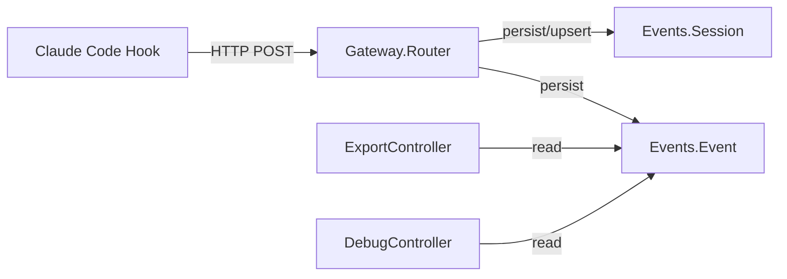

# ichor_events Refactor Analysis

## Overview

Ash domain for the raw hook event stream. Two resources: Event (individual hook events) and
Session (aggregated session records). Backed by SQLite. Total: 3 files, ~167 lines.

---

## Module Inventory

| Module | File | Lines | Type | Purpose |
|--------|------|-------|------|---------|
| `Ichor.Events` | events.ex | 9 | Ash Domain | Domain root for Event and Session |
| `Ichor.Events.Event` | events/event.ex | 90 | Ash Resource | Individual hook event from Claude Code (SQLite) |
| `Ichor.Events.Session` | events/session.ex | 68 | Ash Resource | Aggregated session record (SQLite) |

---

## Cross-References

### Called by
- `IchorWeb.Controllers.ExportController` -> `Ash.read(Event, action: :read)` (VIOLATION: bypasses code_interface)
- `IchorWeb.Controllers.DebugController` may use these resources
- `Ichor.Gateway.Router.EventIngest` may persist events here

### Calls out to
None. Pure Ash resources with AshSqlite data layer.

---

## Architecture



---

## Boundary Violations

### HIGH: ExportController bypasses code_interface

`IchorWeb.Controllers.ExportController` (export_controller.ex:9) calls:
```elixir
case Ash.read(Event, action: :read) do
```

This bypasses `code_interface`. `Ichor.Events.Event` should expose a `read!/0` or `all!/0`
code_interface function, and the controller should call that.

### MEDIUM: No policies defined

Neither `Event` nor `Session` has Ash policies. Any actor can read/write. For a hook ingestion
endpoint that receives data from untrusted Claude Code agents, access control should be explicit
(even if it's just `authorize_if always()`).

### LOW: Session resource likely underused

`Ichor.Events.Session` exists alongside `Ichor.Events.Event`. It's unclear from the code
whether sessions are actively maintained or if this is partially implemented. Audit usage.

---

## Consolidation Plan

### No merging needed
Two resources, well-separated.

### Additions needed

1. **Add `code_interface` to both resources**: At minimum `define(:all, action: :read)` and
   `define(:create)`.

2. **Add policies**: Even `authorize_if always()` is better than implicit unrestricted access.
   Document why (trusted internal system, no multi-tenant requirements).

---

## Priority

### HIGH

- [ ] Add `code_interface` block to `Ichor.Events.Event`
- [ ] Fix `ExportController` to use code_interface instead of `Ash.read/2`

### MEDIUM

- [ ] Add explicit policies to both resources
- [ ] Audit `Ichor.Events.Session` usage -- is it actively maintained?
