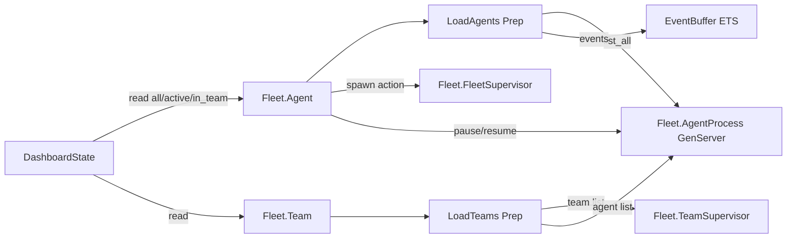

# ichor_fleet Refactor Analysis

## Overview

Ash domain for the fleet: Agent and Team resources. These are view-only resources -- they
have no SQLite data layer. Reads are served by custom preparations that pull from ETS registries
and the event buffer. Generic actions delegate to the BEAM-native GenServer layer in the host.
Total: 5 files, ~765 lines.

---

## Module Inventory

| Module | File | Lines | Type | Purpose |
|--------|------|-------|------|---------|
| `Ichor.Fleet` | fleet.ex | 9 | Ash Domain | Domain root for Agent and Team |
| `Ichor.Fleet.Agent` | fleet/agent.ex | 311 | Ash Resource | Fleet agent view (no DB; read via preparation; actions via GenServer) |
| `Ichor.Fleet.Team` | fleet/team.ex | 122 | Ash Resource | Fleet team view (no DB; read via preparation) |
| `Ichor.Fleet.Views.Preparations.LoadAgents` | fleet/views/preparations/load_agents.ex | 62 | Preparation | Loads agents from AgentProcess.list_all() |
| `Ichor.Fleet.Views.Preparations.LoadTeams` | fleet/views/preparations/load_teams.ex | 261 | Preparation | Loads teams from registry; joins with event data |

---

## Cross-References

### Called by
- `IchorWeb.DashboardState` -> `Ichor.Fleet.{Agent,Team}` reads (via domain)
- `IchorWeb.DashboardSpawnHandlers` -> `Ichor.Fleet.Agent.spawn/1` action
- `IchorWeb.DashboardSessionControlHandlers` -> `Ichor.Fleet.Agent.pause_agent/1`,
  `Ichor.Fleet.Agent.resume_agent/1`, `Ichor.Fleet.Agent.shutdown_agent/1`
- Various dashboard helpers reference `Ichor.Fleet.Team` for team data

### Calls out to (from preparations)
- `LoadAgents` -> `Ichor.Fleet.AgentProcess.list_all()` (host app)
- `LoadAgents` -> `Ichor.EventBuffer.list_events()` (host app)
- `LoadTeams` -> `Ichor.Fleet.TeamSupervisor.*` (host app)
- `LoadTeams` -> `Ichor.Fleet.AgentProcess.list_all()` (host app)

---

## Architecture



---

## Boundary Violations

### HIGH: `LoadTeams` preparation is 261 lines (OVER LIMIT)

`Ichor.Fleet.Views.Preparations.LoadTeams` (load_teams.ex, 261 lines) is over the 200-line
limit and has multiple responsibilities: team aggregation, member joining, health computation,
last-event joining. Split into:
- `LoadTeams` (orchestrator, <80 lines)
- `TeamHealthComputer` (pure health score logic)
- `TeamMemberJoiner` (pure join of agents into teams)

### MEDIUM: Generic actions in Agent resource are 200+ lines

`Ichor.Fleet.Agent` (311 lines) has many generic actions (`spawn`, `pause_agent`,
`resume_agent`, `shutdown_agent`, `send_message_to_agent`, `update_instructions`,
`update_metadata`, `register_agent`). Each action body is an anonymous function with
significant imperative logic. This is valid Ash but the resource is doing orchestration.

Per ash-elixir-expert.md: "A bad refactor usually starts naming-first." The function shapes
are actually clean (input: arguments, output: :ok/:error map). But the orchestration logic
(deciding which GenServer to call, error handling) should ideally live in a service module
that the action delegates to, keeping action bodies thin.

### MEDIUM: No policies

Neither `Agent` nor `Team` has policies. The `Fleet.Agent` resource has `spawn`, `shutdown`,
and `kill_session` actions that are destructive operations. Add explicit policies.

### LOW: Agent resource has no SQLite data layer but uses uuid_v7-like primary keys

The `agent_id` attribute is a string primary key. This is correct for a view resource but
should be documented clearly in `@moduledoc`.

---

## Consolidation Plan

### Split needed

1. **`LoadTeams` (261L)**: Split into `LoadTeams` (coordinator) + `TeamMemberJoiner` +
   `TeamHealthComputer`. Each under 80 lines.

### Refactor needed

2. **`Fleet.Agent` generic action bodies**: Extract the GenServer delegation logic into
   `Ichor.Fleet.AgentActions` module. Action bodies become single-line delegates:
   ```elixir
   run(fn input, _context -> AgentActions.spawn(input.arguments) end)
   ```

### Additions needed

3. **Add policies** to both `Agent` and `Team` resources.

---

## Priority

### HIGH

- [ ] Split `LoadTeams` (261L) into focused modules

### MEDIUM

- [ ] Extract action body logic from Fleet.Agent to a service module
- [ ] Add policies to Agent and Team

### LOW

- [ ] Document "view resource" pattern in `@moduledoc`
