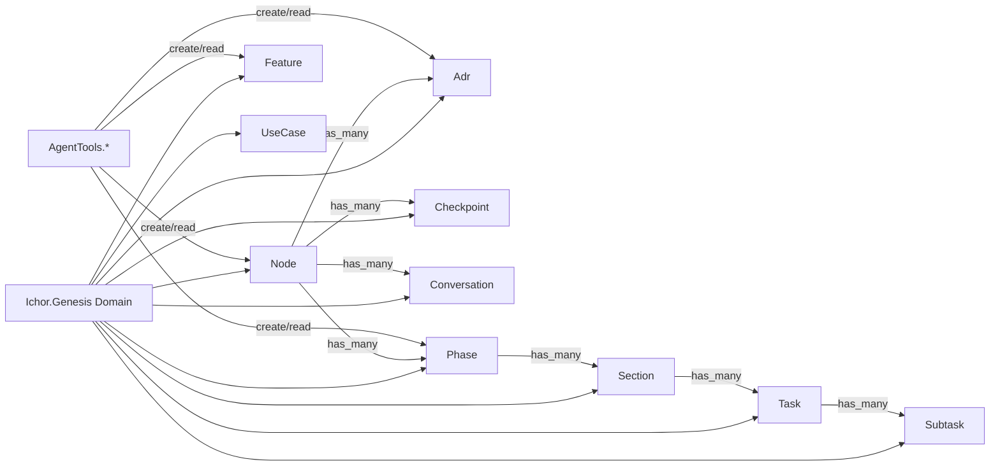
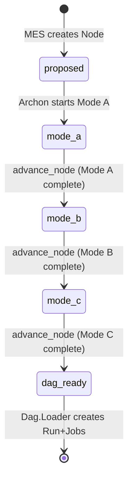

# ichor_genesis Refactor Analysis

## Overview

Ash domain for the Genesis planning pipeline: Node, Adr, Feature, UseCase, Checkpoint,
Conversation, Phase, Section, Task, Subtask. All backed by SQLite. 11 files, ~882 lines.
This is a well-structured, bounded Ash domain. The resources are clean with proper
code_interface, relationships, and actions.

---

## Module Inventory

| Module | File | Lines | Type | Purpose |
|--------|------|-------|------|---------|
| `Ichor.Genesis` | genesis.ex | 29 | Ash Domain | Domain root for all Genesis resources |
| `Ichor.Genesis.Node` | genesis/node.ex | 132 | Ash Resource | Genesis project node (SQLite) -- tracks mode A->B->C state |
| `Ichor.Genesis.Adr` | genesis/adr.ex | 113 | Ash Resource | Architecture Decision Record (SQLite) |
| `Ichor.Genesis.Feature` | genesis/feature.ex | 82 | Ash Resource | Feature specification (SQLite) |
| `Ichor.Genesis.UseCase` | genesis/use_case.ex | 81 | Ash Resource | Use case definition (SQLite) |
| `Ichor.Genesis.Checkpoint` | genesis/checkpoint.ex | 85 | Ash Resource | Mode gate checkpoint (SQLite) |
| `Ichor.Genesis.Conversation` | genesis/conversation.ex | 82 | Ash Resource | Agent conversation log (SQLite) |
| `Ichor.Genesis.Phase` | genesis/phase.ex | 90 | Ash Resource | Mode C execution phase (SQLite) |
| `Ichor.Genesis.Section` | genesis/section.ex | 76 | Ash Resource | Phase section (SQLite) |
| `Ichor.Genesis.Task` | genesis/task.ex | 90 | Ash Resource | Implementation task (SQLite) |
| `Ichor.Genesis.Subtask` | genesis/subtask.ex | 122 | Ash Resource | Task subtask (SQLite) |

---

## Cross-References

### Called by (from ichor host app)
- `Ichor.AgentTools.GenesisNodes` -> `Ichor.Genesis.Node` via code_interface
- `Ichor.AgentTools.GenesisArtifacts` -> `Ichor.Genesis.{Adr,Feature,UseCase}` via code_interface
- `Ichor.AgentTools.GenesisGates` -> `Ichor.Genesis.{Checkpoint,Conversation}` via code_interface
- `Ichor.AgentTools.GenesisRoadmap` -> `Ichor.Genesis.{Phase,Section,Task,Subtask}` via code_interface
- `Ichor.Dag.Spawner` -> `Ichor.Genesis.Node.get/1` (PARTIAL VIOLATION: via code_interface but from DAG context)
- `Ichor.Dag.Loader` -> `Ichor.Genesis.{DagGenerator,Node}` (host app helpers)
- `Ichor.Dag.RunProcess` -> `Ichor.Genesis.ModeRunner` (host app)
- `Ichor.Mes.CompletionHandler` -> `Ichor.Genesis.Node` via code_interface
- `IchorWeb.DashboardMesHandlers` -> `Ichor.Genesis.Node` directly (VIOLATION)
- `IchorWeb.DashboardInfoHandlers` -> `Ichor.Genesis.Node.by_project/2` directly (VIOLATION)
- `IchorWeb.Components.MesFactoryComponents` -> `Ichor.Genesis.PipelineStage` (host module)

### Calls out to
None. Pure Ash resources with SQLite data layer.

---

## Architecture

### Genesis Mode Pipeline

---

## Boundary Violations

### MEDIUM: Dashboard LiveView bypasses Ichor.Genesis domain API

`IchorWeb.DashboardMesHandlers` (dashboard_mes_handlers.ex:9) and
`IchorWeb.DashboardInfoHandlers` (dashboard_info_handlers.ex:186) call
`Ichor.Genesis.Node` code_interface functions directly instead of going through the
`Ichor.Genesis` domain module.

While `code_interface` functions on a resource are public, the intended access pattern in
Ash is to expose them via the domain. The domain module (`Ichor.Genesis`) should delegate
these calls via `code_interface` at the domain level, and LiveViews should alias the domain,
not individual resources.

**Fix**: Add domain-level `code_interface` delegates or ensure the `Ichor.Genesis` module
is the only aliased module in LiveViews (not individual resource modules).

### LOW: No policies on any Genesis resource

All resources use defaults with no explicit authorization policies. This is acceptable for
a single-operator system but should be documented. If multi-agent write access is intended
(agents create ADRs, checkpoints, etc.), actor-based policies are needed.

---

## Consolidation Plan

### No merging needed
All 11 resources are appropriately sized (76-132 lines). No module is over the limit.

### Potential additions

1. **Domain-level code_interface delegates**: Add `define` at the `Ichor.Genesis` domain
   level so callers can do `Ichor.Genesis.create_adr(attrs)` rather than
   `Ichor.Genesis.Adr.create(attrs)`. This enforces the domain-as-API pattern.

2. **Policies**: Add `authorize_if always()` or actor-based policies when multi-agent
   access is required.

---

## Priority

### MEDIUM

- [ ] Add domain-level `code_interface` delegates to `Ichor.Genesis`
- [ ] Update LiveView handlers to use domain instead of individual resource modules

### LOW

- [ ] Add explicit policies to all resources (even `authorize_if always()` for clarity)
