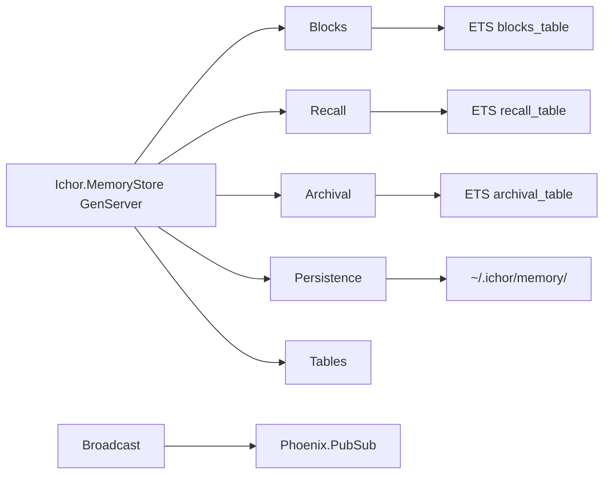

# ichor_memory_core Refactor Analysis

## Overview

Pure helper library for the `Ichor.MemoryStore` GenServer. All modules are pure functions or
ETS utilities. No OTP processes, no Ash resources. 6 files, ~561 lines. The split from
`MemoryStore` is correct: the GenServer in the host app handles serialization and dirty-state
tracking; these modules handle the actual ETS operations and disk I/O.

---

## Module Inventory

| Module | File | Lines | Type | Purpose |
|--------|------|-------|------|---------|
| `Ichor.MemoryStore.Tables` | memory_store/tables.ex | 26 | Pure Function | ETS table name constants and size limits |
| `Ichor.MemoryStore.Blocks` | memory_store/blocks.ex | 154 | Pure Function | Block CRUD on ETS: create, get, update, delete, compile |
| `Ichor.MemoryStore.Recall` | memory_store/recall.ex | 53 | Pure Function | Recall memory CRUD on ETS: add, get, search |
| `Ichor.MemoryStore.Archival` | memory_store/archival.ex | 98 | Pure Function | Archival memory CRUD on ETS: insert, search, delete, count |
| `Ichor.MemoryStore.Persistence` | memory_store/persistence.ex | 217 | Pure Function | Disk load/save: JSON files for blocks, JSONL for recall/archival |
| `Ichor.MemoryStore.Broadcast` | memory_store/broadcast.ex | 13 | Pure Function | PubSub broadcast for block/agent change events |

---

## Cross-References

### Called by
- `Ichor.MemoryStore` GenServer (host app) calls ALL modules here as helpers

### Calls out to
- `Ichor.MemoryStore.Broadcast` -> `Phoenix.PubSub.broadcast/3` (crosses into Phoenix)
- `Ichor.MemoryStore.Persistence` -> `Jason.decode/1`, `Jason.encode!/1`
- `Ichor.MemoryStore.Tables` -> `:ets.*` calls

---

## Architecture

---

## Boundary Violations

### LOW: `Persistence` is 217 lines (OVER LIMIT)

`Ichor.MemoryStore.Persistence` at 217 lines exceeds the 200-line guide. However, the
module is tightly cohesive: it owns disk serialization for both blocks and agents. A
mechanical split would reduce clarity. If splitting, do:
- `Persistence.Blocks` (block file load/save)
- `Persistence.Agents` (agent dir load/save)
- `Persistence` (coordinator: `load_from_disk`, `flush_dirty`)

### LOW: `Broadcast` calls Phoenix.PubSub directly

`Ichor.MemoryStore.Broadcast` (broadcast.ex) calls `Phoenix.PubSub.broadcast/3`. This
couples a data-layer helper to the transport layer. The GenServer in the host should own
broadcasting; Broadcast should just be a pure signal builder that returns the topic and
message, and the GenServer calls the signal.

In practice: `Broadcast.agent_changed/2` emits via PubSub. This should be
`Ichor.Signals.emit(:block_changed, ...)` rather than raw PubSub, to be consistent with
the signals pattern.

---

## Consolidation Plan

### Consider splitting Persistence
If `Persistence` grows, split by entity type (blocks vs agents).

### Replace raw PubSub in Broadcast
`Broadcast.agent_changed/2` should emit via `Ichor.Signals` not raw PubSub.

---

## Priority

### LOW

- [ ] Replace raw PubSub in `Broadcast` with `Ichor.Signals.emit/2`
- [ ] Split `Persistence` if it grows beyond 200 lines
