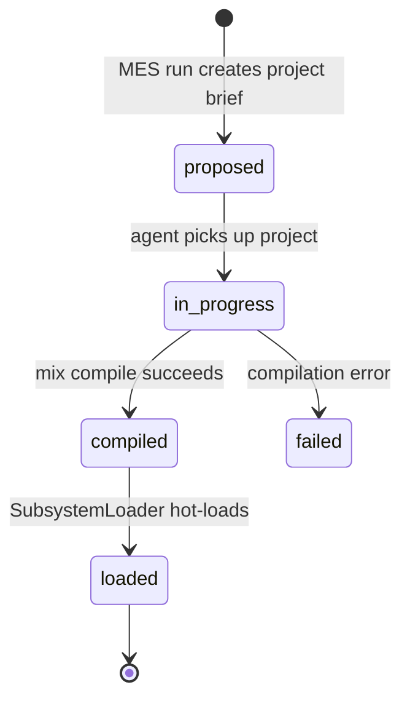

# ichor_mes Refactor Analysis

## Overview

Ash domain for the Manufacturing Execution System. One resource: Project (the subsystem
brief). Backed by SQLite. 2 files, ~252 lines. The domain is minimal; most MES logic lives
in the host app under `Ichor.Mes.*`.

---

## Module Inventory

| Module | File | Lines | Type | Purpose |
|--------|------|-------|------|---------|
| `Ichor.Mes` | mes.ex | 15 | Ash Domain | Domain root for MES resources |
| `Ichor.Mes.Project` | mes/project.ex | 237 | Ash Resource | Subsystem project brief (SQLite) -- the output of a MES run |

---

## Cross-References

### Called by
- `Ichor.Archon.Tools.Mes` -> `Ichor.Mes.Project` via code_interface (list_all!, by_status!, create)
- `Ichor.Mes.ProjectIngestor` -> `Ichor.Mes.Project` via code_interface
- `Ichor.Mes.SubsystemLoader` -> reads projects to load subsystems
- `IchorWeb.DashboardLive` -> aliases `Ichor.Mes.Project`
- `IchorWeb.DashboardMesHandlers` -> `Ichor.Mes.Project` for pipeline view
- `IchorWeb.DashboardState` -> reads projects during recompute

### Calls out to
- `Ichor.Signals.FromAsh` after_action hook on status change (signal emission)

---

## Architecture



---

## Boundary Violations

### MEDIUM: `Ichor.Mes.Project` is 237 lines (OVER LIMIT)

At 237 lines, the resource slightly exceeds the 200-line limit. The file contains:
- Many JSONB-style attributes (features, use_cases, dependencies -- arrays)
- Create action with 13+ accepted attributes
- Several read actions (by_status, by_subsystem, by_run, by_team)
- Status update actions (pick_up, mark_compiled, mark_loaded, mark_failed)
- code_interface block

The resource is cohesive but bloated by attribute count. One improvement: move the
`maybe_put` helper and `project_to_map` function from `Ichor.Archon.Tools.Mes` into a
dedicated `Ichor.Mes.Project.Presenter` module that handles view serialization.

### MEDIUM: `Archon.Tools.Mes` calls code_interface without going through domain

`Ichor.Archon.Tools.Mes` aliases `Ichor.Mes.Project` directly and calls `Project.list_all!()`,
`Project.by_status!()`, `Project.create()`. These should be aliased through the `Ichor.Mes`
domain. Add domain-level code_interface delegates.

### LOW: No policies

`Ichor.Mes.Project` has no authorization policies. Status transitions like `pick_up` and
`mark_loaded` are unrestricted. If agents can write projects (they can via `ProjectIngestor`),
at minimum document the trust model.

---

## Consolidation Plan

### Extract presenter
Move `project_to_map/1` from `Archon.Tools.Mes` to `Ichor.Mes.Project.Presenter` module.
This keeps serialization logic adjacent to the schema.

### Add domain-level delegates
```elixir
# In Ichor.Mes domain:
code_interface do
  resource(Ichor.Mes.Project)
  define(:list_projects)
  define(:create_project, args: [:attrs])
  define(:by_status, args: [:status])
end
```

---

## Priority

### MEDIUM

- [ ] Add domain-level code_interface delegates to `Ichor.Mes`
- [ ] Update `Archon.Tools.Mes` to alias `Ichor.Mes` not `Ichor.Mes.Project`
- [ ] Extract `project_to_map/1` to `Ichor.Mes.Project.Presenter`

### LOW

- [ ] Add explicit policies to `Ichor.Mes.Project`
- [ ] Trim Project resource to <200 lines by extracting helpers
