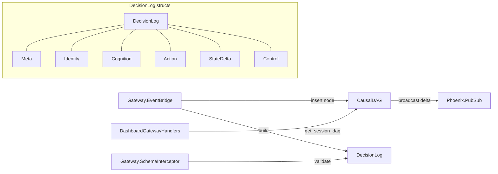

# ichor_mesh Refactor Analysis

## Overview

Two modules: CausalDAG (ETS-backed directed acyclic graph for session event causality) and
DecisionLog (the canonical envelope struct for gateway events). Combined: 675 lines across
2 files. Both modules violate the nested module rule severely.

---

## Module Inventory

| Module | File | Lines | Type | Purpose |
|--------|------|-------|------|---------|
| `Ichor.Mesh.CausalDAG` | mesh/causal_dag.ex | 398 | GenServer | Per-session ETS DAG with orphan buffering, cycle prevention, PubSub deltas |
| `Ichor.Mesh.DecisionLog` | mesh/decision_log.ex | 277 | Other | Envelope struct for gateway events (contains 6 nested sub-structs) |

---

## Cross-References

### Called by
- `Ichor.Gateway.EventBridge` -> `Ichor.Mesh.CausalDAG.insert/2`
- `Ichor.Gateway.EventBridge` -> `Ichor.Mesh.DecisionLog` (build + put_gateway_entropy_score)
- `Ichor.Gateway.SchemaInterceptor` -> `Ichor.Mesh.DecisionLog` (changeset validation)
- `IchorWeb.DashboardGatewayHandlers` -> `Ichor.Mesh.CausalDAG.get_session_dag/1`
- `Ichor.Gateway.TopologyBuilder` -> `Ichor.Mesh.CausalDAG`

### Calls out to
- `CausalDAG` -> `Phoenix.PubSub.broadcast/3` (raw PubSub, not signals)

---

## Architecture

---

## Boundary Violations

### HIGH: DecisionLog has 6 nested module definitions (violates BRAIN.md rule)

`Ichor.Mesh.DecisionLog` (decision_log.ex:17,54,84,120,158,183) defines:
- `Ichor.Mesh.DecisionLog.Meta`
- `Ichor.Mesh.DecisionLog.Identity`
- `Ichor.Mesh.DecisionLog.Cognition`
- `Ichor.Mesh.DecisionLog.Action`
- `Ichor.Mesh.DecisionLog.StateDelta`
- `Ichor.Mesh.DecisionLog.Control`

Each must be extracted to its own file in `ichor_mesh/lib/ichor/mesh/decision_log/`:
- `decision_log/meta.ex`
- `decision_log/identity.ex`
- `decision_log/cognition.ex`
- `decision_log/action.ex`
- `decision_log/state_delta.ex`
- `decision_log/control.ex`

### HIGH: CausalDAG has nested `Node` module definition

`Ichor.Mesh.CausalDAG` (causal_dag.ex:14) defines `Node` as a nested struct. Must be
extracted to `ichor_mesh/lib/ichor/mesh/causal_dag/node.ex` as
`Ichor.Mesh.CausalDAG.Node`.

### HIGH: CausalDAG is 398 lines (double the limit)

At 398 lines, `CausalDAG` is nearly twice the 200-line guide. Responsibilities:
- ETS table management per session
- Node insertion with duplicate detection
- Ancestor chain traversal for cycle prevention
- Orphan buffer management (30s window)
- Session sweep (30-minute timer)
- PubSub delta broadcast

Split plan:
- `CausalDAG` (GenServer interface: start_link, insert, get_session_dag, ~80 lines)
- `CausalDAG.Storage` (ETS ops: ensure_session_table, do_insert, orphan resolution)
- `CausalDAG.Traversal` (ancestor chain, cycle detection)
- `CausalDAG.SessionSweep` (stale session cleanup)

### MEDIUM: CausalDAG uses raw PubSub instead of signals

`CausalDAG` broadcasts directly via `Phoenix.PubSub.broadcast/3` on `"session:dag:{sid}"`.
This bypasses the `Ichor.Signals` catalog. The DAG session topic is a dynamic scoped signal --
it should be emitted via `Ichor.Signals.emit(:dag_node_inserted, session_id, data)` using a
dynamic scoped signal, or at least document why raw PubSub is used here.

### MEDIUM: DecisionLog uses Ecto.Changeset for validation

`Ichor.Mesh.DecisionLog` uses `Ecto.Changeset` directly for validation in `SchemaInterceptor`.
In an Ash project, Ecto changesets are generally discouraged outside resource definitions.
Consider replacing with pure function validation or an Ash embedded resource.

---

## Consolidation Plan

### Split DecisionLog nested modules (MANDATORY)
Extract all 6 nested struct modules to own files. DecisionLog itself stays as the top-level
struct with `build/1`, `put_gateway_entropy_score/2`, `changeset/2`.

### Split CausalDAG
- `CausalDAG` (GenServer, public API, ~80 lines)
- `CausalDAG.Node` (struct, ~30 lines)
- `CausalDAG.Storage` (ETS insert, validate, orphan buffer, ~120 lines)
- `CausalDAG.Traversal` (ancestor_chain, detect_cycle, ~80 lines)
- `CausalDAG.SessionSweep` (stale session GC, ~60 lines)

---

## Priority

### HIGH (must fix -- violates BRAIN.md)

- [ ] Extract `DecisionLog.Meta`, `Identity`, `Cognition`, `Action`, `StateDelta`, `Control` to own files
- [ ] Extract `CausalDAG.Node` to own file
- [ ] Split `CausalDAG` into 4 focused modules

### MEDIUM

- [ ] Replace CausalDAG raw PubSub with `Ichor.Signals` dynamic scoped emission
- [ ] Evaluate replacing Ecto.Changeset validation in DecisionLog with pure functions
