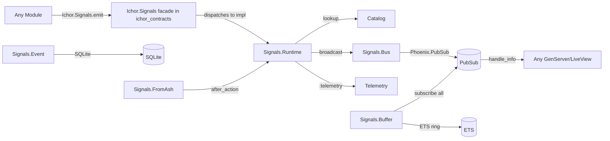

# ichor_signals Refactor Analysis

## Overview

The signals subsystem: runtime implementation, PubSub transport, ETS buffer, signal catalog
(split into 5 bounded definition modules), Ash domain for persisted signal events. Total:
12 files, ~920 lines. This is the result of the 2026-03-18 ichor_contracts refactor.

The contract surface (Signals facade, Behaviour, Topics, Message, Noop) lives in
`subsystems/ichor_contracts/`. This app owns only the host-side implementation.

---

## Module Inventory

| Module | File | Lines | Type | Purpose |
|--------|------|-------|------|---------|
| `Ichor.Signals.Runtime` | signals/runtime.ex | 89 | Pure Function | Behaviour impl: emit, subscribe, unsubscribe, telemetry |
| `Ichor.Signals.Bus` | signals/bus.ex | 23 | Pure Function | PubSub broadcast/subscribe wrappers |
| `Ichor.Signals.Buffer` | signals/buffer.ex | 79 | GenServer | ETS ring buffer: stores last N signals per category |
| `Ichor.Signals.Domain` | signals/domain.ex | 12 | Ash Domain | Domain root for Signal Event resource |
| `Ichor.Signals.Event` | signals/event.ex | 97 | Ash Resource | Persisted signal event log (SQLite) |
| `Ichor.Signals.FromAsh` | signals/from_ash.ex | 37 | Change | Ash after_action hook: emits signal on resource mutations |
| `Ichor.Signals.Catalog` | signals/catalog.ex | 76 | Pure Function | Catalog: lookup, validate, derive, categories |
| `Ichor.Signals.Catalog.CoreDefs` | signals/catalog/core_defs.ex | 56 | Pure Function | Core signal definitions |
| `Ichor.Signals.Catalog.GatewayAgentDefs` | signals/catalog/gateway_agent_defs.ex | 125 | Pure Function | Gateway + agent signal definitions |
| `Ichor.Signals.Catalog.GenesisDagDefs` | signals/catalog/genesis_dag_defs.ex | 98 | Pure Function | Genesis + DAG signal definitions |
| `Ichor.Signals.Catalog.MesDefs` | signals/catalog/mes_defs.ex | 185 | Pure Function | MES signal definitions (OVER LIMIT) |
| `Ichor.Signals.Catalog.TeamMonitoringDefs` | signals/catalog/team_monitoring_defs.ex | 43 | Pure Function | Team + monitoring signal definitions |

---

## Cross-References

### Called by (everything subscribes to signals)
- `Ichor.Archon.SignalManager` -> `Ichor.Signals.subscribe/1` for all categories
- `Ichor.Archon.TeamWatchdog` -> `Ichor.Signals.subscribe/1` for fleet/dag/genesis/monitoring
- `Ichor.SwarmMonitor` -> `Ichor.Signals.subscribe(:events)`
- `Ichor.MemoriesBridge` -> subscribes to all catalog categories
- `Ichor.NudgeEscalator` -> `Ichor.Signals.subscribe(:heartbeat)` + raw PubSub (mixed)
- `Ichor.ProtocolTracker` -> `Ichor.Signals.subscribe(:heartbeat)` + raw PubSub (mixed)
- `Ichor.Fleet.AgentProcess` -> `Ichor.Signals.subscribe(:agent_event, id)` (scoped)
- All GenServers that emit -> `Ichor.Signals.emit/2` or `emit/3`
- `IchorWeb.DashboardLive` -> subscribes to all signal categories in mount

### Calls out to
- `Runtime` -> `Ichor.Signals.Bus` -> `Phoenix.PubSub`
- `Runtime` -> `:telemetry.execute/3`
- `Buffer` -> ETS
- `Event` -> `Ichor.Repo` (SQLite via AshSqlite)
- `FromAsh` -> `Ichor.Signals.emit/2` (back to Runtime)

---

## Architecture

---

## Boundary Violations

### MEDIUM: `Catalog.MesDefs` is 185 lines (approaching limit)

`Ichor.Signals.Catalog.MesDefs` at 185 lines contains MES signal definitions. It is approaching
the 200-line limit. If more MES signals are added, split into:
- `MesDefs.Lifecycle` (run/team lifecycle signals)
- `MesDefs.Subsystem` (subsystem/hot-load signals)

### LOW: `Signals.Event` has no code_interface

`Ichor.Signals.Event` (the SQLite-backed signal log) has no `code_interface` block. If it
is used (persisting signal events for forensics), it needs queryable actions exposed via
code_interface. If it is not used, it should be removed.

### LOW: Mixed subscription patterns across the codebase

Some modules use `Ichor.Signals.subscribe(:heartbeat)` (correct, catalog-validated) while
others also subscribe to raw PubSub `"events:stream"`. See: `Ichor.AgentMonitor`,
`Ichor.NudgeEscalator`, `Ichor.ProtocolTracker`. This should be standardized to signals-only.

### LOW: `Catalog.derive/1` allows uncatalogued signals

`Ichor.Signals.Catalog.lookup!/1` (catalog.ex:41) falls back to `derive/1` which infers the
category from the signal name prefix. This means any atom can be emitted without being in
the catalog. The intent is flexibility but it undermines the catalog-as-source-of-truth design.

Either enforce strict catalog-only emission (raise on unknown signals) or document the
derive escape hatch as intentional.

---

## Consolidation Plan

### No merging needed
12 modules is appropriate. Each is well-sized.

### Actions

1. **`MesDefs` watch**: Pre-split when it exceeds 200 lines.

2. **Standardize subscriptions**: Replace raw PubSub subscriptions in AgentMonitor,
   NudgeEscalator, ProtocolTracker with `Ichor.Signals.subscribe/1`.

3. **Audit `Signals.Event`**: If used, add code_interface. If not used, delete.

4. **Document or enforce catalog-only**: Make an explicit decision about `derive/1`.

---

## Priority

### MEDIUM

- [ ] Audit `Ichor.Signals.Event` -- used or dead? Add code_interface or delete
- [ ] Replace raw PubSub subscriptions in AgentMonitor/NudgeEscalator/ProtocolTracker
      with `Ichor.Signals.subscribe/1`

### LOW

- [ ] Document or enforce catalog-only emission (the `derive/1` escape hatch)
- [ ] Monitor MesDefs size; pre-split at 180 lines
