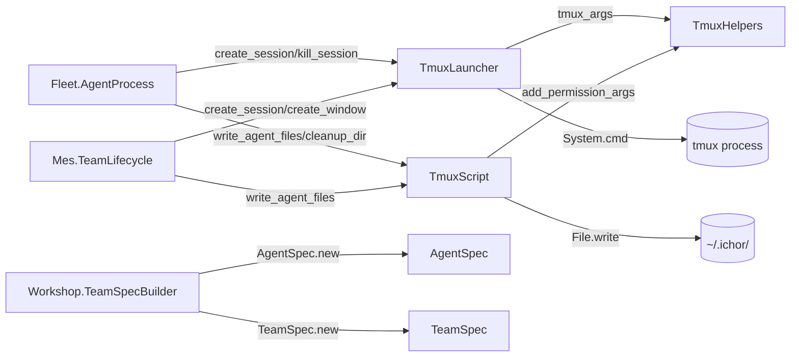

# ichor_tmux_runtime Refactor Analysis

## Overview

Pure library providing tmux-backed agent spawning infrastructure. No OTP processes, no Ash
resources. Five modules: two struct builders (AgentSpec, TeamSpec), two filesystem/tmux
operators (TmuxLauncher, TmuxScript), and a shared helpers module (TmuxHelpers). Total: 5
files, ~238 lines. All modules are well-sized and clean.

---

## Module Inventory

| Module | File | Lines | Type | Purpose |
|--------|------|-------|------|---------|
| `Ichor.Fleet.Lifecycle.AgentSpec` | fleet/lifecycle/agent_spec.ex | 59 | Pure Function | Validated struct for single agent launch spec |
| `Ichor.Fleet.Lifecycle.TeamSpec` | fleet/lifecycle/team_spec.ex | 42 | Pure Function | Validated struct for multi-agent team session |
| `Ichor.Fleet.Lifecycle.TmuxLauncher` | fleet/lifecycle/tmux_launcher.ex | 48 | Pure Function | tmux session/window lifecycle operations |
| `Ichor.Fleet.Lifecycle.TmuxScript` | fleet/lifecycle/tmux_script.ex | 40 | Pure Function | Prompt file and launch script materialization |
| `Ichor.Fleet.TmuxHelpers` | fleet/tmux_helpers.ex | 49 | Pure Function | Shared socket path, capability-to-permission mapping |

---

## Cross-References

### Called by
- `Ichor.Fleet.AgentProcess` (host app) -> `TmuxLauncher`, `TmuxScript` for spawning agents
- `Ichor.Mes.TeamLifecycle` (host app) -> `TmuxLauncher`, `TmuxScript` for MES team launch
- `Ichor.Workshop.TeamSpecBuilder` (ichor_workshop) -> `AgentSpec`, `TeamSpec` to build specs
- `Ichor.Dag.Spawner` (host app) -> likely uses `AgentSpec`/`TeamSpec` via TeamLifecycle

### Calls out to
- `TmuxLauncher` -> `System.cmd("tmux", ...)` (external OS process)
- `TmuxScript` -> `File.mkdir_p`, `File.write`, `File.chmod`, `File.rm_rf!`
- `TmuxHelpers` -> `File.exists?` (for socket detection)

---

## Architecture



---

## Boundary Violations

### NONE

All modules in `ichor_tmux_runtime` are clean:
- No nested modules
- All modules under 200 lines
- No Ash framework dependencies (correct for an infrastructure library)
- Side effects are explicit and isolated to the two operator modules (`TmuxLauncher`,
  `TmuxScript`)
- No process management -- pure functions and `System.cmd` calls only

---

## Design Notes

### AgentSpec and TeamSpec: fetch! pattern

Both `AgentSpec` and `TeamSpec` use an internal `fetch!/2` with a fallback to string keys:

```elixir
defp fetch(attrs, key, default \\ nil) do
  Map.get(attrs, key, Map.get(attrs, to_string(key), default))
end
```

This allows callers to pass either atom or string-keyed maps (e.g., from JSON or LiveView
params). The pattern is a reasonable pragmatic choice but it silently accepts both key types.
If the callers are known to always use atom keys (they are -- Workshop and TeamLifecycle both
use atom-keyed maps), the string-key fallback can be removed for clarity.

### TmuxHelpers: `File.rm_rf!` in TmuxScript

`TmuxScript.cleanup_dir/1` uses `File.rm_rf!/1`. Per project rules (`rm` is disabled,
move to `tmp/trash/`), this should be replaced with a `File.rename/2` into `tmp/trash/`.
This is a LOW priority cleanup but does violate the project-level `rm` restriction.

### Capability-to-permission mapping

`TmuxHelpers.add_permission_args/2` handles capability → CLI args translation. The scout
capability gets an explicit allowedTools list via `--allowedTools` flag. This mapping is
compile-time and correct. If new capabilities are added, this function must be updated.

---

## Consolidation Plan

### No merging or splitting needed

5 modules is appropriate for this library. Each is under 50 lines and has a single
clear responsibility. The boundary between "struct building" (AgentSpec/TeamSpec) and
"OS operations" (TmuxLauncher/TmuxScript) is correct.

---

## Priority

### LOW

- [ ] Replace `File.rm_rf!` in `TmuxScript.cleanup_dir/1` with move-to-trash pattern
- [ ] Remove string-key fallback in `fetch/3` if all callers use atom keys
