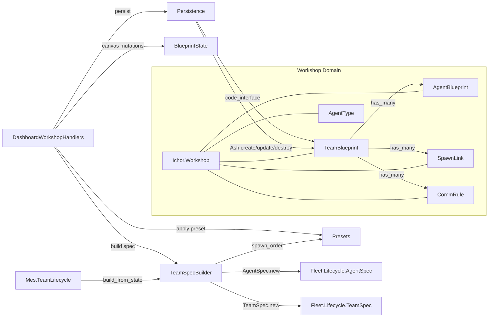

# ichor_workshop Refactor Analysis

## Overview

Ash domain for the visual team blueprint builder (the Workshop canvas). Five Ash resources
(AgentType, TeamBlueprint, AgentBlueprint, SpawnLink, CommRule), plus a pure state machine
(BlueprintState), a preset library (Presets), a spec builder (TeamSpecBuilder), and a
persistence facade. 10 files, ~1288 lines. Two modules exceed the 200-line limit.

---

## Module Inventory

| Module | File | Lines | Type | Purpose |
|--------|------|-------|------|---------|
| `Ichor.Workshop` | workshop.ex | 16 | Ash Domain | Domain root for Workshop resources |
| `Ichor.Workshop.AgentType` | workshop/agent_type.ex | 129 | Ash Resource | Reusable agent archetype (SQLite) |
| `Ichor.Workshop.TeamBlueprint` | workshop/team_blueprint.ex | 105 | Ash Resource | Saved team blueprint with nested relationships (SQLite) |
| `Ichor.Workshop.AgentBlueprint` | workshop/agent_blueprint.ex | 128 | Ash Resource | Agent node within a blueprint (SQLite) |
| `Ichor.Workshop.SpawnLink` | workshop/spawn_link.ex | 57 | Ash Resource | Spawn hierarchy link between blueprint agents (SQLite) |
| `Ichor.Workshop.CommRule` | workshop/comm_rule.ex | 67 | Ash Resource | Communication rule between blueprint agents (SQLite) |
| `Ichor.Workshop.BlueprintState` | workshop/blueprint_state.ex | 271 | Pure Function | Pure canvas state machine: add/remove/update agents, links, rules |
| `Ichor.Workshop.TeamSpecBuilder` | workshop/team_spec_builder.ex | 136 | Pure Function | Translates workshop state into lifecycle TeamSpec/AgentSpec |
| `Ichor.Workshop.Persistence` | workshop/persistence.ex | 54 | Pure Function | Persistence facade: list, save, load, delete blueprints |
| `Ichor.Workshop.Presets` | workshop/presets.ex | 325 | Pure Function | Compile-time blueprint presets and spawn ordering (OVER LIMIT) |

---

## Cross-References

### Called by
- `IchorWeb.DashboardWorkshopHandlers` -> `Ichor.Workshop.Persistence` (list, save, load, delete)
- `IchorWeb.DashboardWorkshopHandlers` -> `Ichor.Workshop.Presets.apply/2`, `names/0`
- `IchorWeb.DashboardWorkshopHandlers` -> `Ichor.Workshop.BlueprintState` (all canvas mutations)
- `IchorWeb.DashboardWorkshopHandlers` -> `Ichor.Workshop.TeamSpecBuilder.build_from_state/2`
- `IchorWeb.DashboardWorkshopHandlers` -> `Ichor.Workshop.AgentType.sorted!/0` (agent type picker)
- `Ichor.Mes.TeamLifecycle` -> `Ichor.Workshop.TeamSpecBuilder.build_from_state/2` (MES launch)

### Calls out to
- `Persistence` -> `Ichor.Workshop.TeamBlueprint` code_interface (by_id, read!) -- **VIOLATION**
- `Persistence` -> `Ash.Changeset.for_create`, `Ash.create`, `Ash.Changeset.for_update`,
  `Ash.update`, `Ash.load`, `Ash.destroy` directly -- **VIOLATION**
- `TeamSpecBuilder` -> `Ichor.Fleet.Lifecycle.AgentSpec`, `TeamSpec` (crosses into ichor_tmux_runtime)
- `TeamSpecBuilder` -> `Ichor.Workshop.Presets.spawn_order/2`
- `BlueprintState` -> no external dependencies (pure functions only)
- `Presets` -> no external dependencies (compile-time data)

---

## Architecture



---

## Boundary Violations

### HIGH: `Persistence` uses raw `Ash.*` functions instead of code_interface

`Ichor.Workshop.Persistence` (persistence.ex:24-35) calls:
- `Ash.Changeset.for_create(TeamBlueprint, :create, params)` followed by `Ash.create()`
- `Ash.Changeset.for_update(blueprint, :update, params)` followed by `Ash.update()`
- `Ash.load(blueprint, [:agent_blueprints, :spawn_links, :comm_rules])`
- `Ash.destroy(blueprint)`

Per Ash domain best practices, all writes should go through `code_interface` functions, not
raw `Ash.Changeset` + `Ash.create/update/destroy`. The `TeamBlueprint` resource already defines
`code_interface` for `:create`, `:update`, `:destroy`. The `Persistence` module should call
those code_interface functions instead.

**Correct pattern:**
```elixir
# Instead of:
TeamBlueprint
|> Ash.Changeset.for_create(:create, params)
|> Ash.create()

# Use:
TeamBlueprint.create(params)
```

### MEDIUM: `Presets` is 325 lines (OVER LIMIT)

`Ichor.Workshop.Presets` at 325 lines exceeds the 200-line limit. The module contains:
- 5 preset definitions as compile-time module attributes (~250 lines of data)
- `names/0`, `fetch/1`, `apply/2` (preset retrieval/application, ~30 lines)
- `spawn_order/2`, `walk/3` (topological sort for spawn ordering, ~25 lines)

The preset data is the primary driver of size. Split options:
1. **Extract spawn ordering**: Move `spawn_order/2` and `walk/3` to
   `Ichor.Workshop.SpawnOrder` (~30 lines). Keep `Presets` for data + lookup.
2. **Split preset data**: Move presets into individual modules or a data file (YAML/JSON loaded
   at compile time). This is a bigger change but cleanest long-term.

Option 1 is the minimal fix. It brings `Presets` down to ~295 lines -- still over limit, but
the remaining excess is pure data (map literals), which is less dangerous than logic.

### MEDIUM: `BlueprintState` is 271 lines (OVER LIMIT)

`Ichor.Workshop.BlueprintState` at 271 lines exceeds the 200-line limit. The module contains:
- Type definitions (10 lines)
- Defaults and clear (15 lines)
- Agent CRUD operations: add, select, move, update, remove (70 lines)
- Link CRUD operations: add_spawn_link, remove_spawn_link, add_comm_rule, remove_comm_rule (50 lines)
- Team settings: update_team (10 lines)
- Blueprint serialization: apply_blueprint, to_persistence_params, new_agent, agent_type_agent (40 lines)
- Private conversion helpers: agent_to_ash, ash_to_agent, link/rule converters (30 lines)

The module is cohesive (all pure state transitions for the canvas) but has two separable concerns:
- **State mutations** (add/move/remove/update agents, links, rules)
- **Serialization** (to_persistence_params, apply_blueprint, ash_to_*, *_to_ash)

Split plan:
- `BlueprintState` (state mutations + defaults, ~200 lines)
- `BlueprintState.Serializer` (persistence params + blueprint loading + type conversions, ~80 lines)

### LOW: `Persistence` bypasses domain -- calls resource code_interface directly

`Persistence.list_blueprints/0` calls `TeamBlueprint.read!/0` and `AgentType.sorted!/0` directly.
Per the Ash domain-as-API pattern, access should go through `Ichor.Workshop.*` domain-level
delegates, not individual resource modules. However, since `Ichor.Workshop` domain does not
currently define domain-level `code_interface` delegates, this is a structural gap:

```elixir
# ichor_workshop/lib/ichor/workshop.ex should add:
code_interface do
  resource(Ichor.Workshop.TeamBlueprint)
  define(:list_blueprints)
  define(:create_blueprint, action: :create)
  define(:update_blueprint, action: :update)
  define(:delete_blueprint, action: :destroy)
  define(:blueprint_by_id, action: :by_id, args: [:id])
end
```

### LOW: No policies on any Workshop resource

All 5 resources use default actions with no authorization policies. Workshop blueprints are
editable by anyone with UI access. For a single-operator system this is acceptable, but
document the trust model.

---

## Consolidation Plan

### Fix `Persistence` raw Ash calls (IMMEDIATE)

Replace `Ash.Changeset.for_create(...)` + `Ash.create()` with `TeamBlueprint.create(params)`.
Replace `Ash.Changeset.for_update(...)` + `Ash.update()` with `TeamBlueprint.update(blueprint, params)`.
Replace `Ash.destroy(blueprint)` with `TeamBlueprint.destroy(blueprint)`.

### Add domain-level code_interface to `Ichor.Workshop`

```elixir
# In Ichor.Workshop domain:
code_interface do
  resource(Ichor.Workshop.TeamBlueprint)
  define(:list_blueprints, action: :read)
  define(:create_blueprint, action: :create)
  define(:get_blueprint, action: :by_id, args: [:id])
end
```

### Extract `SpawnOrder` from `Presets`

Move `spawn_order/2` and `walk/3` to `Ichor.Workshop.SpawnOrder`. Update `Presets` and
`TeamSpecBuilder` to alias `SpawnOrder`.

### Split `BlueprintState` into state + serializer

- `BlueprintState`: agent/link/rule/team mutations (~200L)
- `BlueprintState.Serializer`: `to_persistence_params/1`, `apply_blueprint/2`, private
  conversion helpers (~80L)

---

## Priority

### HIGH (must fix -- raw Ash calls violate code_interface pattern)

- [ ] Replace raw `Ash.create/update/destroy` in `Persistence` with resource code_interface calls

### MEDIUM

- [ ] Extract `spawn_order/2` from `Presets` to `Ichor.Workshop.SpawnOrder`
- [ ] Split `BlueprintState` into mutations + serializer
- [ ] Add domain-level `code_interface` delegates to `Ichor.Workshop`

### LOW

- [ ] Add explicit policies to all Workshop resources
- [ ] Remove `Presets.fetch/1` wrapper -- it's a passthrough around `Map.fetch/2`
