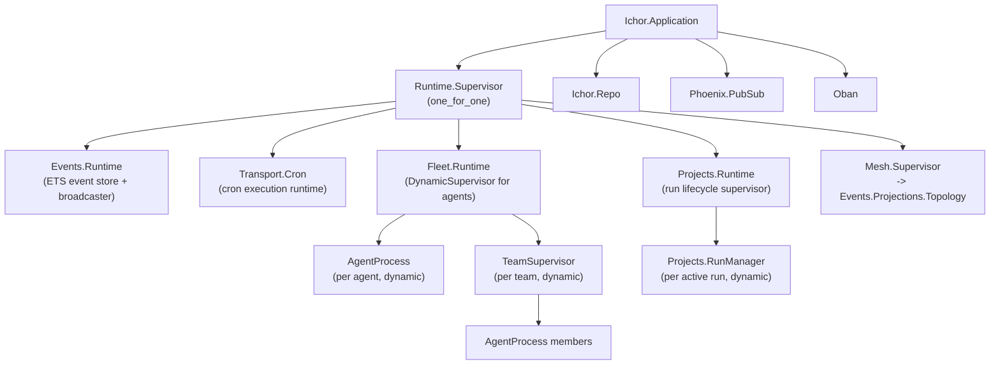

# Supervision Tree
Related: [Index](INDEX.md) | [Infrastructure](infrastructure.md) | [Target Structure](target-file-structure.md)

---

## Target Supervision Tree

---

## Current vs. Target: Supervisor Strategy

| Supervisor | Current Strategy | Target Strategy | Rationale |
|-----------|-----------------|-----------------|-----------|
| `Ichor.Application` children | `one_for_one`, 14 children flat | Delegate to `Runtime.Supervisor` | Flat supervision mixes failure domains |
| `Runtime.Supervisor` (new) | -- | `one_for_one` | Independent subsystems; one crash should not cascade |
| `Fleet.Runtime` (FleetSupervisor) | `one_for_one` dynamic | `one_for_one` dynamic | Each AgentProcess is independent |
| `Projects.Runtime` | `one_for_one` | `one_for_one` | Runs are independent; one failed run should not kill others |
| `Mesh.Supervisor` | `one_for_one` | Absorbed into `Runtime.Supervisor` | Only supervises 2 children; not worth a level |
| `TeamSupervisor` | `:temporary` dynamic per team | `:temporary` | Teams are ephemeral; do not restart |

---

## GenServer Keep / Eliminate

| Process | Current | Target | Justification |
|---------|---------|--------|---------------|
| `Events.Runtime` (EventStream) | GenServer + ETS | Keep GenServer | Owns ETS write path + subscription fanout. ETS reads are concurrent without it. |
| `Fleet.AgentProcess` | GenServer per agent | Keep GenServer | IS the agent. Holds mailbox, backend, live state. Cannot be reconstructed on demand. |
| `Fleet.Runtime` (FleetSupervisor) | DynamicSupervisor | Keep | Must own the AgentProcess lifecycle tree. |
| `Transport.Cron` (CronScheduler) | GenServer wrapping Oban | DELETE GenServer | Wraps what Oban does natively. Move to Oban cron config. |
| `Factory.MesScheduler` | GenServer, Process.send_after | DELETE GenServer | Replace with Oban cron worker on `mes` queue. Pause = queue drain. |
| `Factory.PipelineMonitor` | 623-line GenServer | DELETE GenServer | Serializes all reads. State is recomputable from Ash. Replace with pure query module + Oban cron. |
| `Projects.RunManager` (Runner) | GenServer per run | Keep GenServer | Monitors live run state. Subscribes to signals. Manages lifecycle transitions. |
| `Archon.TeamWatchdog` | GenServer | Convert to signal subscriber | No reason to hold state. Becomes signal handler that enqueues Oban cleanup jobs. |
| `Signals.Buffer` | GenServer ring buffer | DELETE GenServer | ETS is public. Replace counter with `:atomics`. No serialization needed. |
| `Infrastructure.HITLRelay` | GenServer | Keep GenServer | Holds pause/unpause state. Multiple callers need to observe it concurrently. |

---

## Failure Domain Groups

The current flat supervision tree lumps unrelated processes together. Any supervisor crash (unlikely but possible) kills all 14 children.

Target groups by failure domain so a crash in one subsystem does not affect others:

| Group | Children | Impact if group crashes |
|-------|----------|------------------------|
| `Events.Runtime` | ETS event store + broadcaster | Signal delivery stops; no agent processes affected |
| `Fleet.Runtime` | All AgentProcess + TeamSupervisor instances | Agents lose BEAM-side mailbox; tmux processes continue |
| `Projects.Runtime` | Active RunManager instances | Run lifecycle monitoring stops; Ash state preserved |
| `Transport.Cron` | Cron execution runtime | Scheduled deliveries stop; Oban picks up on restart |
| Oban | All background job queues | Retry queues pause; Ash state preserved |

---

## Notes on the ETS / GenServer Split

`Events.Runtime` (the event store) holds ETS tables for:
- The event ring buffer (all recent hook events)
- The session activity map (last-seen timestamps per session)
- The message delivery log

The GenServer serializes **writes** and manages **subscriptions**. Reads go directly to ETS. This is the correct split: `GenServer.call` for writes gives you serialization guarantees without bottlenecking concurrent readers (multiple LiveViews, AgentWatchdog, EventBridge all read simultaneously).

The `Buffer` GenServer was a mistake because its only job was incrementing a counter -- `:atomics` is correct for that.
