# ICHOR IV Architecture Diagrams

Related: [Vertical Slices](../plans/2026-03-21-vertical-slices.md) | [Architecture Audit](../plans/2026-03-21-architecture-audit.md) | [Glossary](../plans/GLOSSARY.md) | [Database Schema](database-schema.md)

---

## Concepts: What Signals Actually Is

Signals is the nervous system. Everything that happens in the app becomes a signal. Anything that needs to react subscribes. No direct cross-domain calls needed.

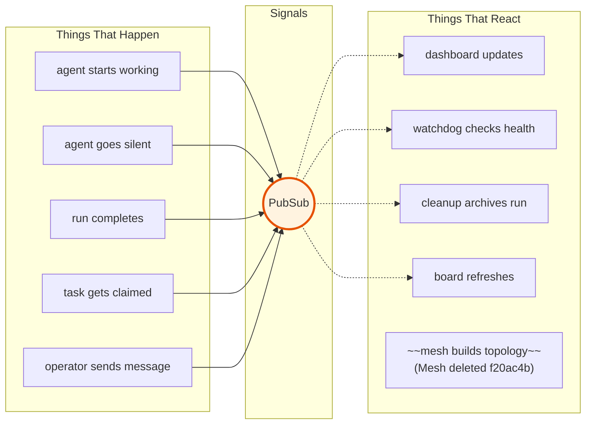

**The rule:** producers emit, subscribers react. A producer never knows who's listening. A subscriber never calls the producer. Signals is the only coupling point between domains.

---

## Concepts: What Spawn Actually Is

`spawn/1` is generic. Give it a team name, it compiles the Workshop design and launches agents in tmux. What the team does is defined by its prompts -- configured in Workshop, not hardcoded.

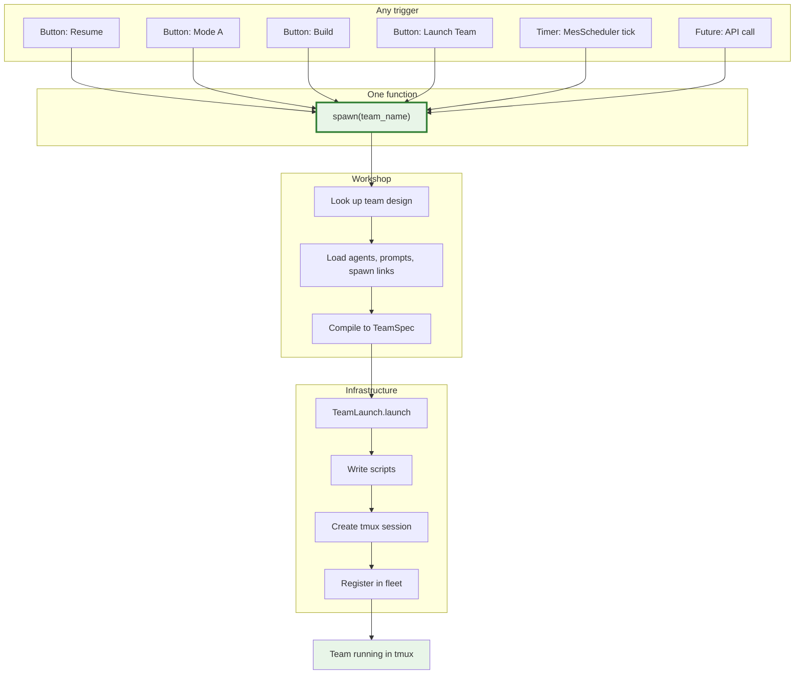

**The rule:** spawn doesn't know what the team will do. It just compiles and launches. Team behavior comes from Workshop-configured prompts.

---

## Concepts: How Constraints Work (no new abstractions)

Constraints on spawning are just pattern matches in signal subscribers. No "Policy" module needed.

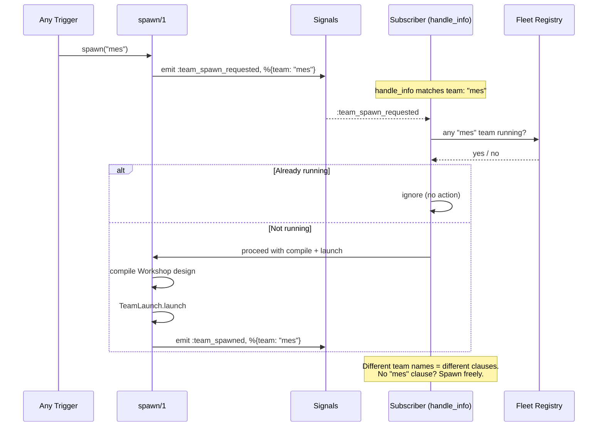

---

## Concepts: Workshop Owns Design, Not Execution

Workshop is where teams are designed. Spawn is where they come alive. The prompt builder in Workshop defines what agents do -- the rest is infrastructure.

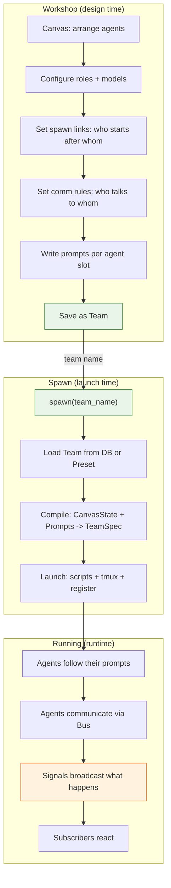

---

## Concepts: The MES Page as Factory Floor

The `/mes` page is a control panel. Every button either spawns a team or produces artifacts for a future spawn.

```mermaid
graph TB
    subgraph "MES Page Controls"
        R["Resume / Pause"]
        MA["Mode A (discover)"]
        MB["Mode B (define)"]
        MC["Mode C (build)"]
        GC["Gate Check"]
        GD["Generate DAG"]
        BD["Build"]
    end

    subgraph "What They Do"
        R -->|"spawn('mes')"| T1["MES research team runs"]
        MA -->|"spawn('planning-a')"| T2["Mode A team produces ADRs"]
        MB -->|"spawn('planning-b')"| T3["Mode B team produces FRDs"]
        MC -->|"spawn('planning-c')"| T4["Mode C team produces roadmap"]
        GC -->|"no spawn"| V["Validate gate readiness"]
        GD -->|"no spawn"| W["Generate tasks.jsonl from roadmap"]
        BD -->|"spawn('pipeline')"| T5["Build team executes tasks"]
    end

    subgraph "All Teams Come From Workshop"
        WS["Workshop team configs"]
        WS -.->|"'mes' config"| T1
        WS -.->|"'planning-a' config"| T2
        WS -.->|"'planning-b' config"| T3
        WS -.->|"'planning-c' config"| T4
        WS -.->|"'pipeline' config"| T5
    end

    style WS fill:#e8f5e8,stroke:#2e7d32,stroke-width:2px
    style R fill:#fff3e0
    style BD fill:#e3f2fd
```

---

## Domain Boundaries

> **Note (2026-03-25)**: Fleet domain was not implemented as a separate Ash domain. Fleet functionality remains in Infrastructure (FleetSupervisor, AgentProcess). The Mesh domain was deleted in f20ac4b. AshSqlite was replaced by AshPostgres.

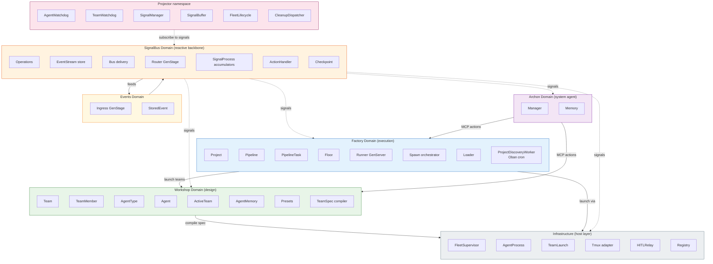

---

## UC2: Launch a Team (Workshop)

### Sequence: User launches a saved team

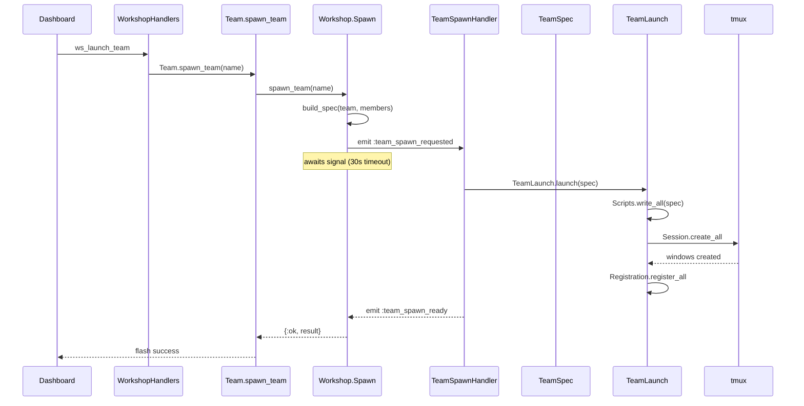

### Flow: Spec compilation

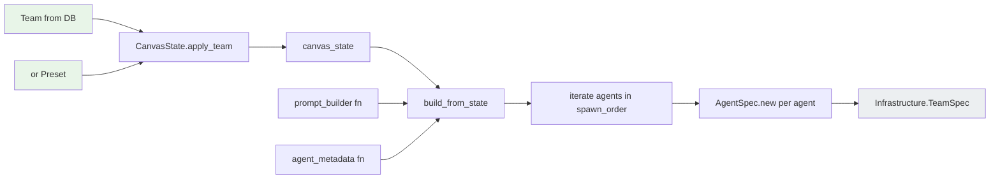

---

## UC3+UC4: Planning and Pipeline Launch (Factory)

### Sequence: User starts a pipeline build

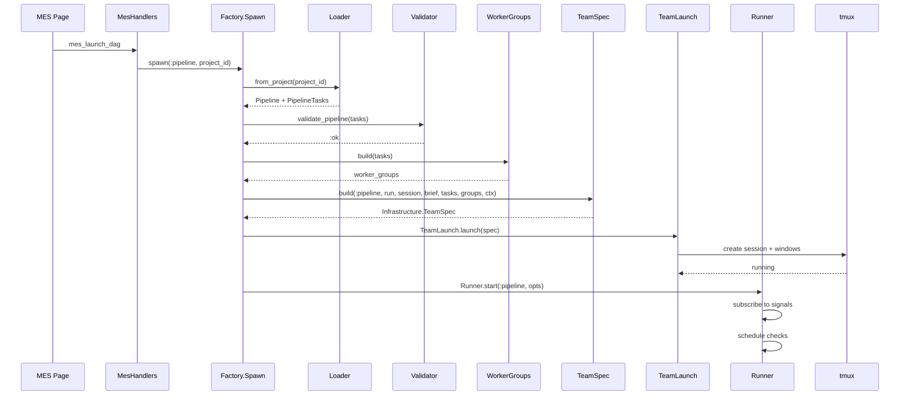

### Flow: Three spawn paths converge

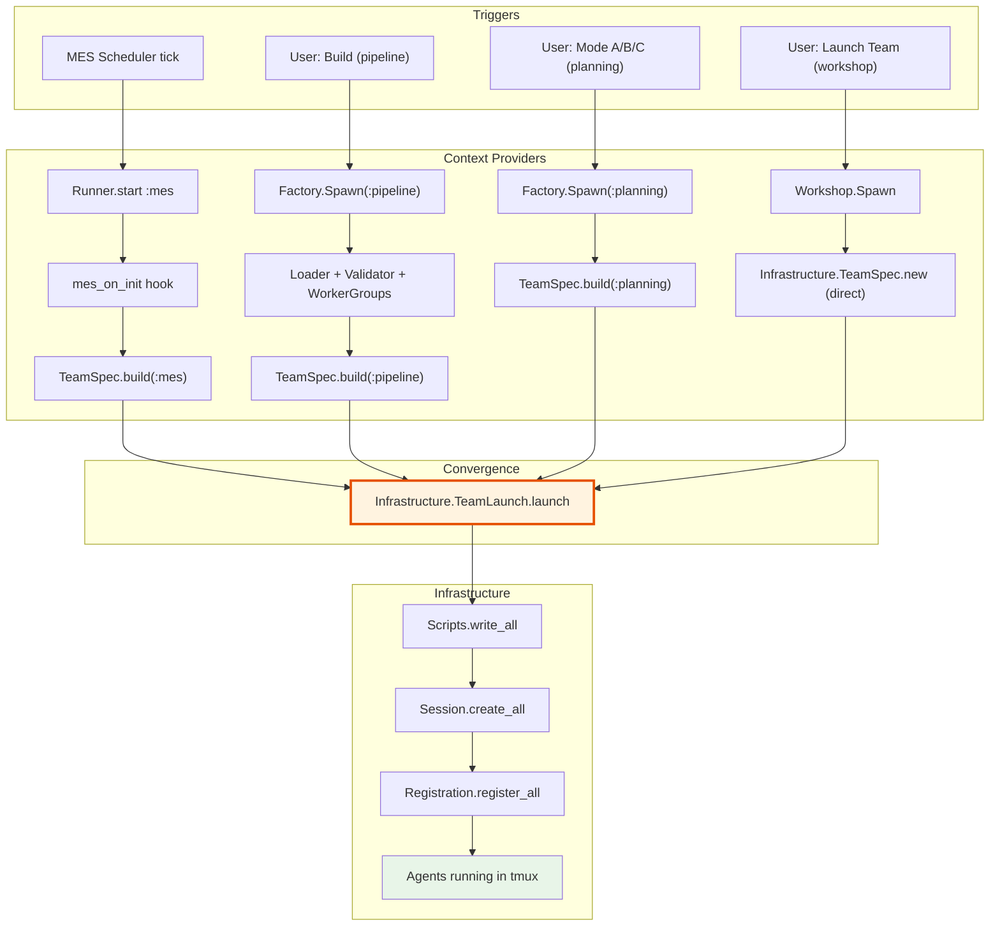

---

## UC5: Monitor the Fleet

### Sequence: Hook event to dashboard update

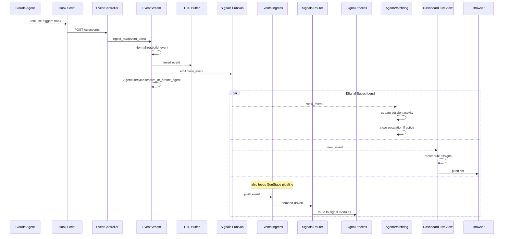

### Flow: AgentWatchdog beat cycle

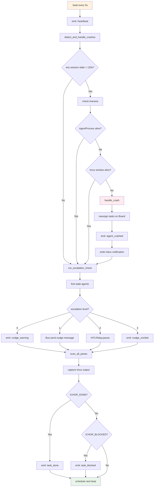

---

## UC6: Agent Communication

### Sequence: Operator sends message to agent

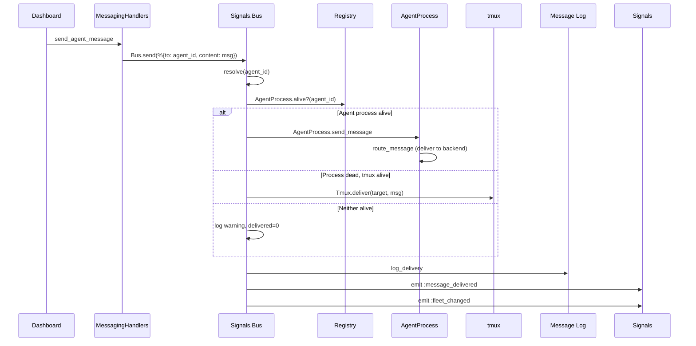

### Flow: Bus target resolution

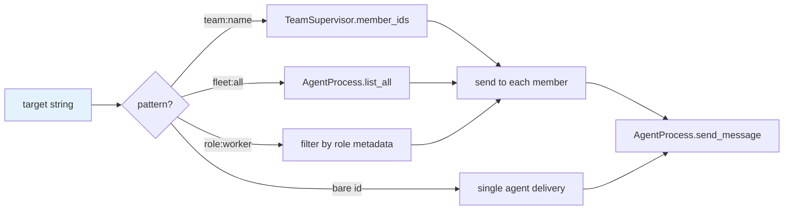

---

## UC7: Pipeline Task Management

### Flow: Two data sources

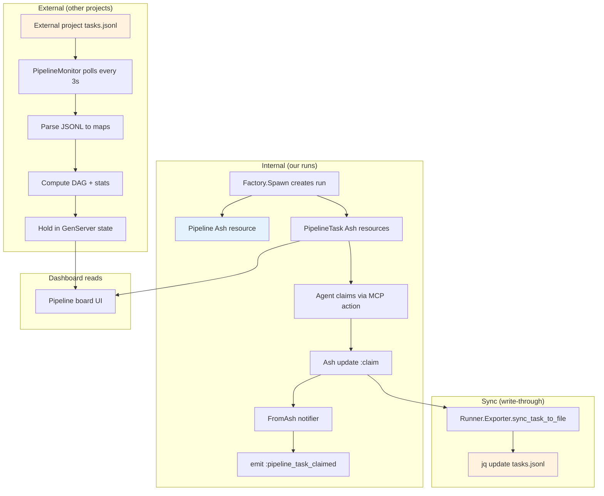

---

## UC8: Run Lifecycle Cleanup

### Sequence: Run completes, cleanup cascades

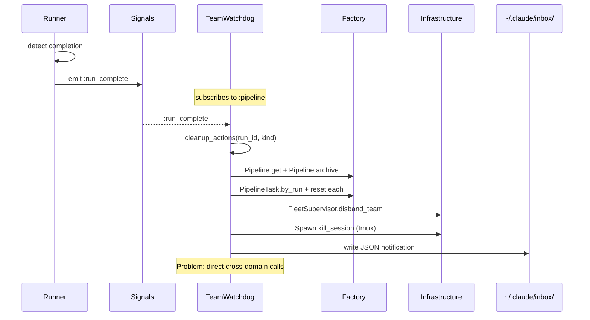

### Flow: Proposed signal-driven cleanup

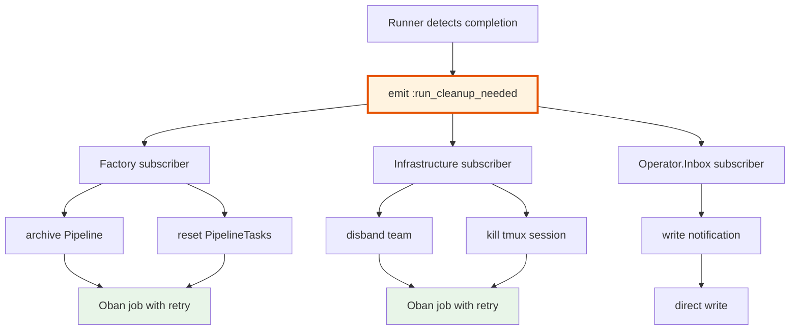

---

## Problem 1: TeamSpec Cross-Boundary

### Current: Caller knowledge inside compiler

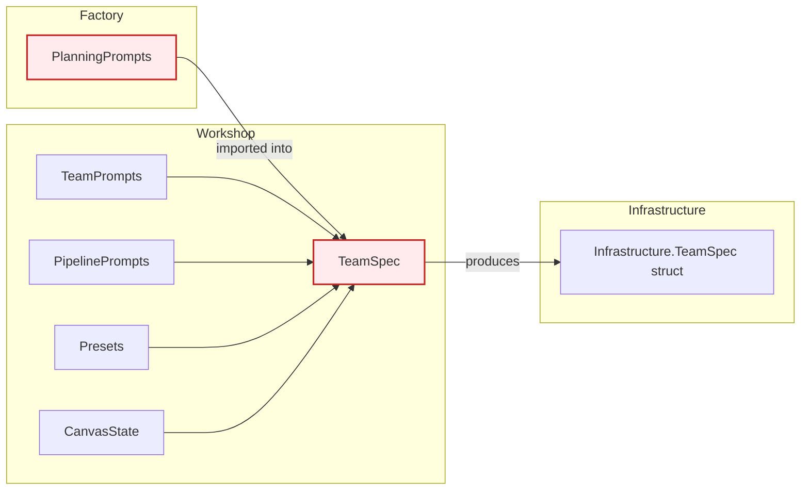

### Proposed: Callers inject strategies

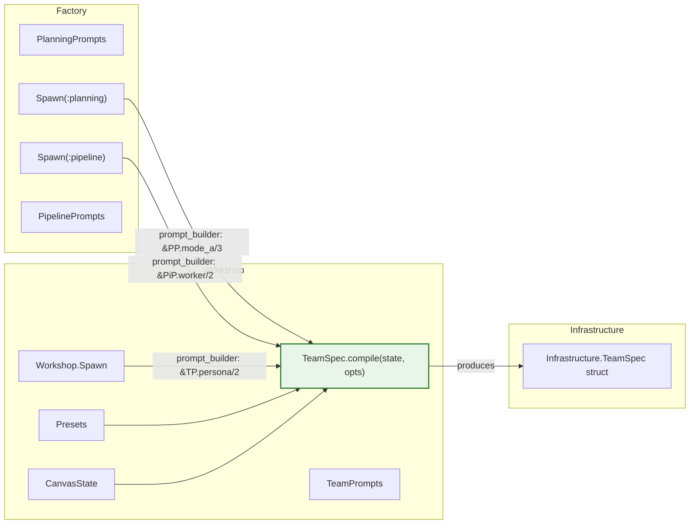

---

## Signal Flow: The Reactive Backbone

> **Updated 2026-03-25**: GenStage pipeline added (ADR-026). PipelineMonitor replaced by ProjectDiscoveryWorker Oban cron.

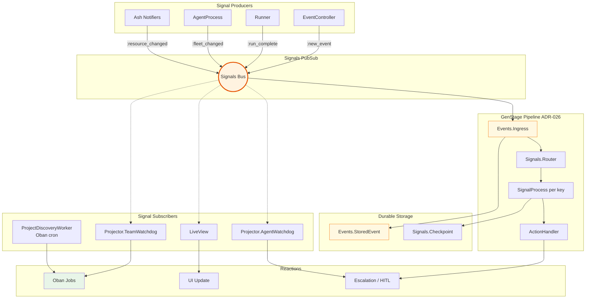

---

## Planned: Ichor.Discovery

```mermaid
flowchart TB
    subgraph Domains
        W[Workshop actions]
        F[Factory actions]
        A[Archon actions]
        S[SignalBus actions]
    end

    subgraph Discovery["Ichor.Discovery"]
        D[list_all_actions_by_domain]
        D --> CAT[Action Catalog]
    end

    subgraph "Workflow Builder UI"
        CAT --> WF[drag-and-drop pipeline]
        WF --> STEP1["Step 1: Factory.create_project"]
        STEP1 --> STEP2["Step 2: Factory.spawn(:planning)"]
        STEP2 --> STEP3["Step 3: wait_for signal"]
        STEP3 --> STEP4["Step 4: Factory.spawn(:pipeline)"]
    end

    W --> D
    F --> D
    A --> D
    S --> D

    style Discovery fill:#f3e5f5,stroke:#7b1fa2,stroke-width:2px
    style WF fill:#e3f2fd
```
