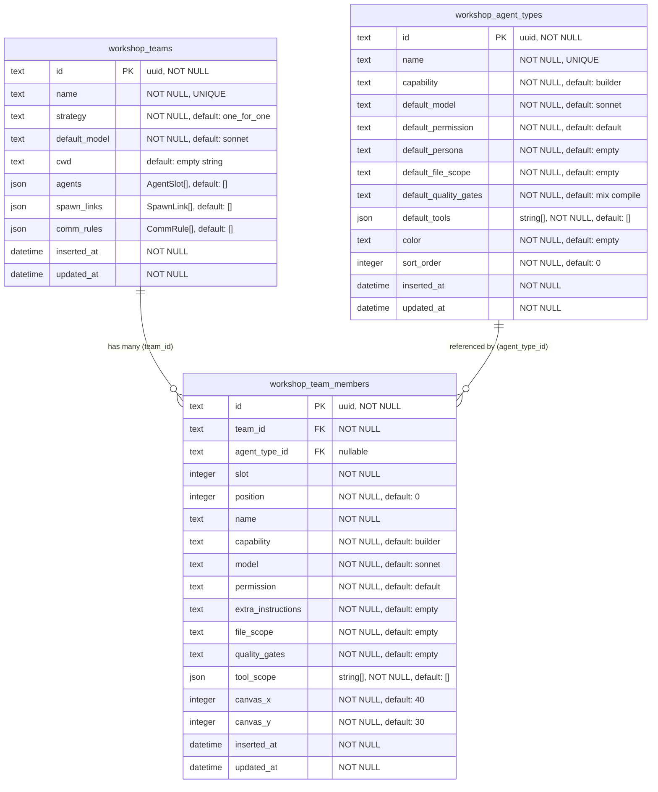
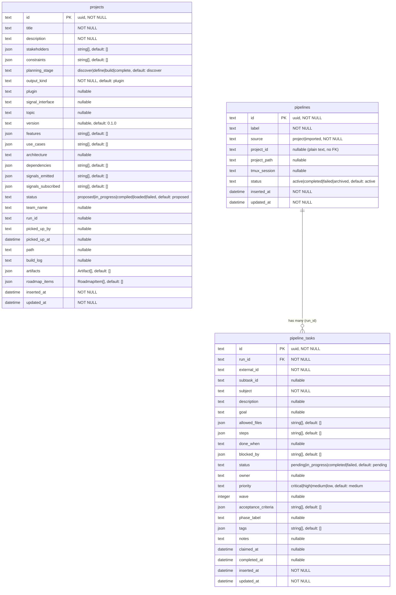
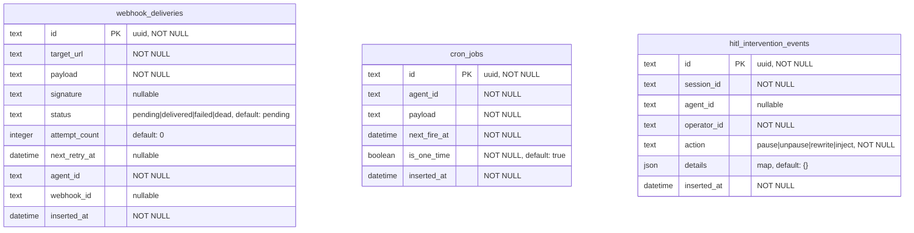
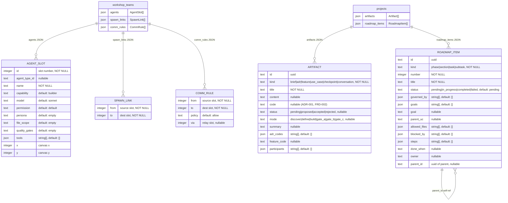

# Database Schema -- ICHOR IV

Generated from source on 2026-03-21. All `AshSqlite.DataLayer` persisted tables and `data_layer: :embedded` resources.

Related: [Glossary](../plans/GLOSSARY.md) | [Architecture Diagrams](architecture.md)

SQLite stores UUIDs as text. Timestamps are ISO 8601 text. Arrays are JSON arrays.

---

## Workshop Domain

Tables: `workshop_teams`, `workshop_team_members`, `workshop_agent_types`

---

## Factory Domain

Tables: `projects`, `pipelines`, `pipeline_tasks`

---

## Infrastructure Domain

Tables: `webhook_deliveries`, `cron_jobs`, `hitl_intervention_events`

All three tables are append-oriented. No foreign keys to other domains -- IDs matched at runtime.

---

## Embedded Resources (JSON Columns)

Stored as JSON arrays inside parent table columns. Never have their own table.

