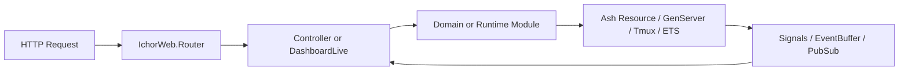
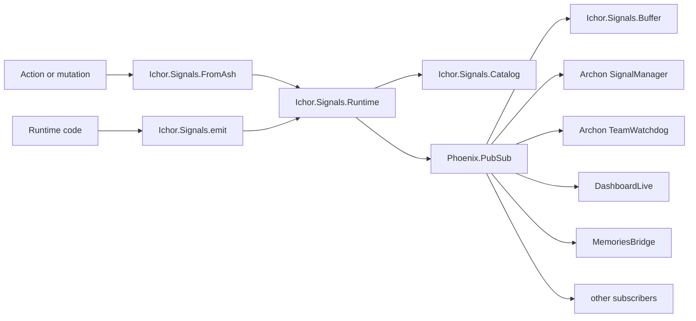
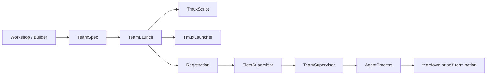
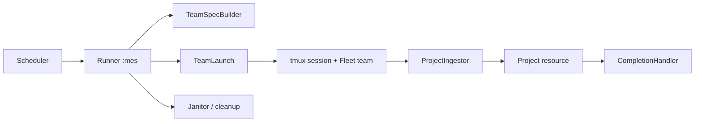
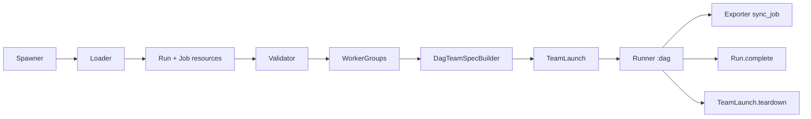

# ICHOR IV Architecture

This document explains how the `lib/ichor` runtime is assembled, how requests and signals move through it, and how the three major orchestration paths work:

- Fleet control and tmux-backed team lifecycle
- MES manufacturing runs
- Genesis-to-DAG execution runs

The code under `lib/ichor` is the core runtime. HTTP and LiveView entrypoints live in `lib/ichor_web`, primarily `IchorWeb.Router` and `IchorWeb.DashboardLive`.

## System Overview

At a high level, ICHOR combines four layers:

1. Web entrypoints
   `IchorWeb.Router`, Phoenix controllers, and `IchorWeb.DashboardLive`
2. Domain and orchestration
   `Ichor.Control`, `Ichor.Projects`, `Ichor.Observability`, `Ichor.Tools`
3. Runtime services
   supervisors, GenServers, tmux launchers, registries, PubSub, event/signal buffers
4. Persistence and external systems
   Ash/SQLite resources, ETS stores, filesystem-backed task stores, tmux, and the Memories graph

## Supervision Tree

Top-level application supervision comes from `Ichor.Application.start/2`.

```text
Ichor.Supervisor (one_for_one)
|- IchorWeb.Telemetry
|- Ichor.Repo
|- Ecto.Migrator
|- DNSCluster
|- Phoenix.PubSub (Ichor.PubSub)
|- Registry (Ichor.Registry)
|- :pg scope (:ichor_agents)
|- Ichor.Control.HostRegistry
|- Ichor.SystemSupervisor
|  |- Ichor.Observability.Janitor
|  |- Ichor.MemoryStore
|  |- Ichor.EventBuffer
|  |- Ichor.Gateway.TmuxDiscovery
|  |- Ichor.Gateway.EntropyTracker
|  |- Ichor.Gateway.HeartbeatManager
|  |- Ichor.Gateway.CronScheduler
|  |- Ichor.Gateway.WebhookRouter
|  |- Ichor.Gateway.HITLRelay
|  |- Ichor.Gateway.OutputCapture
|  |- Ichor.AgentWatchdog
|  |- Ichor.Projects.Runtime
|  |- Ichor.ProtocolTracker
|  |- Ichor.QualityGate
|  |- Ichor.Signals.Buffer
|  |- Ichor.Archon.SignalManager
|  |- Ichor.Archon.TeamWatchdog
|- Ichor.Control.FleetSupervisor
|  |- TeamSupervisor(team_name) -> AgentProcess children
|  |- standalone AgentProcess children
|- Ichor.ObservationSupervisor
|  |- Ichor.Mesh.CausalDAG
|  |- Ichor.Gateway.TopologyBuilder
|  |- Ichor.Gateway.EventBridge
|- Task.Supervisor (Ichor.TaskSupervisor)
|- Ichor.Projects.LifecycleSupervisor
|  |- DynamicSupervisor (Ichor.Projects.BuildRunSupervisor)
|  |- Ichor.Projects.Janitor
|  |- Ichor.Projects.ProjectIngestor
|  |- Ichor.Projects.ResearchIngestor
|  |- Ichor.Projects.CompletionHandler
|  |- Ichor.Projects.Scheduler
|- DynamicSupervisor (Ichor.Projects.PlanRunSupervisor)  # Genesis Runner :genesis children
|- DynamicSupervisor (Ichor.Projects.DynRunSupervisor)   # DAG Runner :dag children
|- Ichor.MemoriesBridge
`- IchorWeb.Endpoint
```

### Why the tree is split this way

- `SystemSupervisor` owns long-lived independent services.
- `FleetSupervisor` owns BEAM-native live agents and teams.
- `ObservationSupervisor` groups event-topology projection services with ordered restart semantics.
- `LifecycleSupervisor` owns the MES subsystem.
- `PlanRunSupervisor` and `DynRunSupervisor` isolate Genesis planning runs from DAG execution runs.

## Request Flow

The common request path is HTTP into Phoenix, then LiveView/controller code, then Ash or orchestration modules, then resources/runtime services.



### Dashboard request flow

```text
Browser
  -> IchorWeb.Router
  -> IchorWeb.DashboardLive
  -> handler modules in lib/ichor_web/live/*
  -> Ichor.Control / Ichor.Projects / Ichor.Observability / Ichor.Signals
  -> Ash resources, GenServers, Registry, ETS, tmux
```

Examples:

- Fleet/workshop actions go through `Ichor.Control.Agent`, `Ichor.Control.Team`, and lifecycle builders.
- MES actions go through `Ichor.Projects.Project`, `Ichor.Projects.Scheduler`, and `Ichor.Projects.Runner` (`:mes` kind).
- Signal views subscribe through `Ichor.Signals.Buffer` and `Phoenix.PubSub`.

### Controller/API request flow

```text
HTTP
  -> Router pipeline
  -> controller
  -> gateway/runtime module
  -> domain/resource/service
```

Examples:

- `/api/events` -> event ingestion -> `Ichor.EventBuffer` and observability resources
- `/gateway/messages` -> `Ichor.Gateway.Router` -> channel adapter -> agent mailbox/tmux/webhook
- HITL endpoints -> `Ichor.Gateway.HITLRelay` + `Ichor.Gateway.HITLInterventionEvent`

## Signal Flow

Signals are the nervous system that connect Ash writes, runtime processes, the dashboard, Archon, and Memories.

```text
action or runtime event
  -> Ichor.Signals.emit/2 or Ichor.Signals.FromAsh.notify/1
  -> Ichor.Signals.Runtime
  -> validate against Ichor.Signals.Catalog
  -> build signal message
  -> Phoenix.PubSub broadcast by category and/or scoped topic
  -> subscribers react
     - Ichor.Signals.Buffer
     - Ichor.Archon.SignalManager
     - Ichor.Archon.TeamWatchdog
     - DashboardLive / signals UI
     - Ichor.MemoriesBridge
     - MES and DAG runtime listeners
```



### Static vs dynamic signals

- Static signals broadcast to a category topic and a signal-specific topic.
- Dynamic signals broadcast to a category topic and a scoped topic such as a run-specific or session-specific stream.

### Main signal producers

- `Ichor.Signals.FromAsh` for Ash resource mutations
- `Ichor.Projects.RuntimeSignals` for DAG runtime events
- MES runtime modules such as `Scheduler` and `Runner` (MES kind)
- Gateway and watchdog services

## Team Lifecycle

The generic team launcher is in `Ichor.Control.Lifecycle.TeamLaunch`. It is reused by Workshop launches, MES teams, Genesis planning teams, and DAG teams.

### Core flow

```text
Workshop state or orchestration module
  -> TeamSpecBuilder / DagTeamSpecBuilder / GenesisTeamSpecBuilder
  -> TeamSpec
  -> TeamLaunch.launch(spec)
     -> TmuxScript.write_agent_files
     -> TmuxLauncher.create_session + create_window
     -> Registration.register each agent
     -> FleetSupervisor / TeamSupervisor / AgentProcess
  -> live tmux-backed team
```

### Lifecycle details

- `TeamSpec` describes the whole tmux session and its agent specs.
- `AgentSpec` describes one window/agent launch contract.
- `TmuxScript` writes prompt and startup files to a prompt directory.
- `TmuxLauncher` creates the session and windows.
- `Registration` registers each agent with the live BEAM fleet.
- `TeamLaunch.teardown/1` kills the tmux session, disbands the fleet team, and removes prompt files.

### Team lifecycle diagram



## MES Pipeline

MES is the manufacturing/execution subsystem rooted at `Ichor.Projects.LifecycleSupervisor`.

### Main modules

- `Ichor.Projects.Scheduler` ticks every minute and starts one build run if concurrency allows.
- `Ichor.Projects.Runner` (`:mes` kind) is one GenServer per MES run.
- `Ichor.Projects.TeamSpecBuilder` and `Ichor.Projects.TeamPrompts` build the MES team contract.
- `Ichor.Projects.ProjectIngestor` detects project briefs arriving from teams.
- `Ichor.Projects.CompletionHandler` compiles and hot-loads finished subsystems.
- `Ichor.Projects.Janitor` cleans up orphaned teams and dead sessions.

### MES flow

```text
Scheduler tick
  -> Runner child (kind: :mes) under BuildRunSupervisor
  -> Runner init: TeamSpecBuilder.build_team_spec
  -> TeamLaunch.launch
  -> live MES team in tmux + fleet registry
  -> agents produce brief
  -> ProjectIngestor detects project creation
  -> Runner stops when session ends or project is created
  -> Janitor cleans residual team/session resources
```



### MES design notes

- Active-run counting comes from the registry rather than local scheduler state.
- `Runner` (`:mes` kind) keeps the run alive while the tmux session is alive.
- Quality gate failures can spawn corrective agents into the existing session.
- `LifecycleSupervisor.start_link/1` also ensures an `operator` `AgentProcess` exists, because MES coordinators deliver back to that mailbox.

## DAG Pipeline

The DAG path turns a Genesis node or `tasks.jsonl` data into an executable run with a coordinator, lead, and file-scoped workers.

### Main modules

- `Ichor.Projects.Spawner` is the high-level entrypoint.
- `Ichor.Projects.Loader` creates the `Run` and `Job` resources.
- `Ichor.Projects.Validator` and `Ichor.Projects.Graph` check DAG integrity.
- `Ichor.Projects.WorkerGroups` groups jobs by shared file ownership.
- `Ichor.Projects.DagTeamSpecBuilder` creates the team contract.
- `Ichor.Projects.Runner` (`:dag` kind) monitors liveness, stale jobs, and completion.
- `Ichor.Projects.Exporter` writes job state back to `tasks.jsonl`.

### DAG flow

```text
Spawner.spawn(node_id, project_id)
  -> fetch Genesis node
  -> scaffold subsystem directory
  -> Loader.from_genesis
  -> Run + Job resources created
  -> Validator.detect_cycles / flat_dag_check
  -> WorkerGroups.group
  -> DagTeamSpecBuilder.build_team_spec
  -> TeamLaunch.launch
  -> Runner.start(:dag, opts) under DynRunSupervisor
  -> Runner monitors liveness, health, stale jobs
  -> coordinator sends completion to operator
  -> Run marked complete
  -> TeamLaunch.teardown
```



### DAG runtime behavior

- `Runner` (`:dag` kind) polls for stale jobs and resets them.
- `Runner` emits health and lifecycle signals through `RuntimeSignals`.
- `Runner` subscribes to delivered messages and treats a coordinator message to `operator` as completion.
- `sync_job/2` performs write-through file export asynchronously.

## Genesis Pipeline

Genesis is the planning pipeline that produces nodes, artifacts, roadmap items, and eventually a DAG-ready run definition.

Main pieces:

- `Ichor.Projects.Node` is the subsystem lifecycle anchor.
- `Ichor.Projects.Artifact` tracks mode-produced deliverables against a node.
- `Ichor.Projects.RoadmapItem` represents a planning item in the Genesis hierarchy.
- `Ichor.Projects.ModeSpawner` launches Genesis mode teams.
- `Ichor.Projects.GenesisTeamSpecBuilder` and `Ichor.Projects.ModePrompts` define those teams.
- `Ichor.Projects.DagGenerator` converts the Mode C roadmap hierarchy into DAG jobs.
- `Ichor.Projects.Runner` (`:genesis` kind) owns one Genesis run process.

Genesis feeds DAG in two ways:

- by creating the roadmap hierarchy used by `DagGenerator`
- by giving `Spawner` and `Loader` the source data for `Run` and `Job`

## Persistence Model

The codebase uses multiple storage strategies on purpose.

- Ash + SQLite
  durable domain resources such as agents, blueprints, nodes, jobs, runs, projects, events, webhook deliveries
- ETS
  high-churn in-memory runtime state such as notes, signals, memory blocks, and causal DAG edges
- Registry / `:pg`
  process discovery for agents, runs, and cluster hosts
- Filesystem
  tmux prompt files, team tasks, `tasks.jsonl`, generated subsystem projects, scheduler pause flags
- External systems
  tmux, webhook targets, and the Memories knowledge graph

## Web Boundary Notes

Even though these docs focus on `lib/ichor`, a new developer should know the web boundary modules that drive most runtime activity:

- `IchorWeb.Router` is the HTTP and LiveView entrypoint.
- `IchorWeb.DashboardLive` is the main operator UI and subscribes directly to signals.
- Phoenix controllers in `lib/ichor_web/controllers` expose event, gateway, HITL, export, and debug APIs.

That means the common developer path is:

```text
UI or API
  -> web module
  -> domain/runtime module in lib/ichor
  -> Ash resource or GenServer
  -> signal/event emission
  -> dashboard / Archon / cleanup subscribers
```

## Module Landmarks

When orienting in the codebase, start here:

- Application boot: `Ichor.Application`
- Core services: `Ichor.SystemSupervisor`
- Live fleet: `Ichor.Control.FleetSupervisor`, `Ichor.Control.AgentProcess`
- Team launch: `Ichor.Control.Lifecycle.TeamLaunch`
- Signals: `Ichor.Signals.Runtime`, `Ichor.Signals.Catalog`, `Ichor.Signals.FromAsh`
- MES: `Ichor.Projects.Scheduler`, `Ichor.Projects.Runner` (`:mes` kind)
- DAG: `Ichor.Projects.Spawner`, `Ichor.Projects.DagTeamSpecBuilder`, `Ichor.Projects.Runner` (`:dag` kind)
- Observability: `Ichor.EventBuffer`, `Ichor.Observability`, `Ichor.Mesh.CausalDAG`
- Tools: `Ichor.Tools`, `Ichor.Tools.Agent.*`, `Ichor.Tools.Archon.*`
